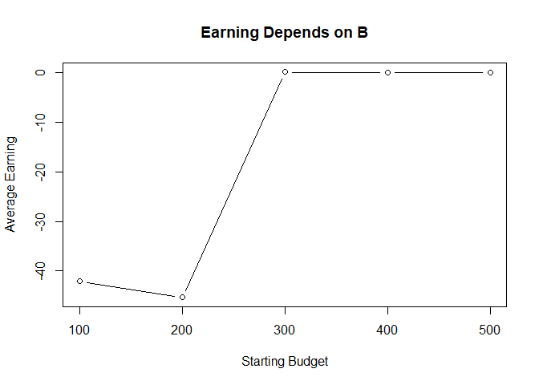
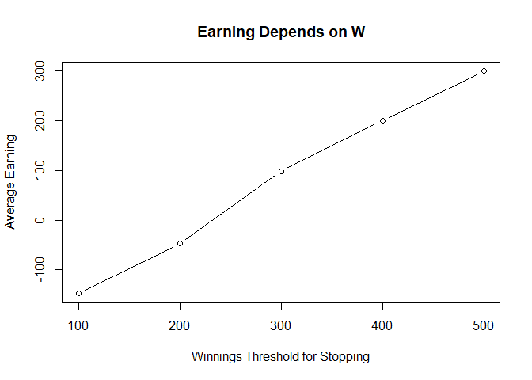

The Martingale Strategy in Roulette
================
Jingyuan Wu
09/04/2021

# Introduction

This blog is showing how to use computer simulation to understand the
operating characteristics of the Martingale Strategy.

## What is Roulette?

A roulette table composed of 38 (or 37) evenly sized pockets on a wheel.
2 are green, 18 are red, and 18 are black. The pockets are also
numbered. Roulette is a game of chance in which a pocket is randomly
selected. Gamblers may wager on the color or number of the random
selected pockets. The payout for a bet on black (or red) is $1 for each
$1 wagered. This means that if a gambler bets $1 on black and the
randomly selected pocket is black, then the gambler will get the
original $1 wager and an additional $1 as winnings.

## The Martingale Strategy

The strategy plays out for a single sequence of spins.

{Black, Black, Red}.

| Play | Wager | Outcome | Earnings |
|:----:|:-----:|:-------:|:--------:|
|  1   |   1   |  Black  |    -1    |
|  2   |   2   |  Black  |    -3    |
|  3   |   4   |   Red   |    +1    |

Now consider a sequence {Black, Black, Black, Red}.

| Play | Wager | Outcome | Earnings |
|:----:|:-----:|:-------:|:--------:|
|  1   |   1   |  Black  |    -1    |
|  2   |   2   |  Black  |    -3    |
|  3   |   4   |  Black  |    -7    |
|  4   |   8   |   Red   |    +1    |

# Simulation

The Martingale Strategy appears to always end in positive earnings,
regardless of how unlucky a string of spins may be. Simulations will be
used below to show whether the strategy is actually profitable.

## Parameters Description

B: Starting budget  
W: Winnings threshold for stopping  
L: Time threshold for stopping  
M: Casino’s maximum wager  

## Supposed Starting Value of Parameters

B = $200  
W = $300 (Starting budget + $100 winnings)  
L = 1000 plays  
M = $100  

## Start A Series of Wager in a Simulation

In casino games, people always pay attention to their ROI. As a result,
the calculation of the average earnings of a gambler that uses this
strategy comes first.

Start from a single play using the Martingale Strategy. There will be a
for loop below to simulate the iteration of a series of wagers.

*Notes: There are also some temporary variables/functions introduced
into this simulation.*

-   state: list, the list of updated values after spinning the roulette
    wheel

-   plays: integer, the number of plays executed

-   previous\_wager: number, the wager in the previous play (0 at first
    play)

-   previous\_win: TRUE/FALSE, indicator if the previous play was a win
    (TRUE at first play)

``` r
library(tidyverse)
library(dplyr)
```

``` r
#' @return The updated state list
one_play <- function(state){
  
    # Wager
    proposed_wager <- ifelse(state$previous_win, 1, 2*state$previous_wager)
    wager <- min(proposed_wager, state$M, state$B)
    # Spin of the wheel
    red <- rbinom(1,1,18/38)
    # Update state
    state$plays <- state$plays + 1
    state$previous_wager <- wager
    if(red){
      # WIN
      state$B <- state$B + wager
      state$previous_win <- TRUE
    }else{
      # LOSE
      state$B <- state$B - wager
      state$previous_win <- FALSE
    }
  state
}
```

**Stopping Rule**

The simulation loop will end (which also means that the gambler has to
stop) if it meets any of the following situations:

-   the player has W dollars

-   the player goes bankrupt

-   the player completes L wagers (or plays)

In logical expressions:

-   @param B &gt;= W

-   @param B &lt;= 0

-   plays &gt;= L

``` r
#' Stopping rule
#'
#' Takes the state list and determines if the gambler has to stop
#' @param state A list.  See one_play
#' @return TRUE/FALSE
stop_play <- function(state){
  if(state$B <= 0) return(TRUE)
  if(state$plays >= state$L) return(TRUE)
  if(state$B >= state$W) return(TRUE)
  FALSE
}


#' Play roulette to either bankruptcy, success, or play limits
#'
#' @param B number, the starting budget
#' @param W number, the budget threshold for successfully stoping
#' @param L number, the maximum number of plays 
#' @param M number, the casino wager limit
#' @return A vector of budget values calculated after each play.
one_series <- function(
    B = 200
  , W = 300
  , L = 1000
  , M = 100
){

  # initial state
  state <- list(
    B = B
  , W = W
  , L = L
  , M = M
  , plays = 0
  , previous_wager = 0
  , previous_win = TRUE
  )
  
  # vector to store budget over series of plays
  budget <- rep(NA, L)
  
  # For loop of plays
  for(i in 1:L){
    new_state <- state %>% one_play
    budget[i] <- new_state$B
    if(new_state %>% stop_play){
      return(budget[1:i])
    }
    state <- new_state
  }
  budget    
}

# helper function
get_last <- function(x) x[length(x)]

# Simulation
walk_out_money <- rep(NA, 10000)
for(j in seq_along(walk_out_money)){
  walk_out_money[j] <- one_series(B = 200, W = 300, L = 1000, M = 100) %>% get_last
}
# Walk out money distribution
hist(walk_out_money, breaks = 100)
```

<!-- -->

The histogram above shows the distribution of walk out money after 10000
trials. There are only two results: a gambler will have 300 dollars or 0
when he walks out of the casino.

``` r
# Estimated probability of walking out with extra cash
mean(walk_out_money > 200)
```

    ## [1] 0.5136

``` r
# Estimated earnings
mean(walk_out_money - 200)
```

    ## [1] -45.8905

After 10000 trials, the gambler will loose an average of about 46
dollars in this simulation. There is a new parameter **walk out money**
added to the simulation, which stands for the money the gambler owns
after the game ends. As the starting budget is 200 dollars, the
estimated earning of the gambler can be (walk\_out\_money - 200). Then,
take the average of 10000 trials’ estimated earnings (walk\_out\_money -
200) as **the average earnings of a gambler that uses the Martingale
Strategy**. Similarly, the average probability of walking out with extra
cash is calculated by taking the average of 10000 trials’ estimated
probability of walking out with extra cash (walk\_out\_money &gt; 200).
The average probability is slightly greater than 50%, which indicates
the Martingale Strategy is considered as a “winning strategy” with
“negative earning money”.

``` r
library(magrittr)
single_spin <- function(){
  possible_outcomes <- c(rep("red",18), rep("black",18), rep("green",2))
  sample(possible_outcomes, 1)
}

martingale_wager <- function(
  previous_wager
  , previous_outcome
  , max_wager
  , current_budget
){
  if(previous_outcome == "red") return(1)
  min(2*previous_wager, max_wager, current_budget)
}

one_play <- function(previous_ledger_entry, max_wager){
  # Create a copy of the input object that will become the output object
  out <- previous_ledger_entry
  out[1, "game_index"] <- previous_ledger_entry[1, "game_index"] + 1
  out[1, "starting_budget"] <- previous_ledger_entry[1, "ending_budget"]
  out[1, "wager"] <- martingale_wager(
    previous_wager = previous_ledger_entry[1, "wager"]
    , previous_outcome = previous_ledger_entry[1, "outcome"]
    , max_wager = max_wager
    , current_budget = out[1, "starting_budget"]
  )
  out[1, "outcome"] <- single_spin()
  out[1, "ending_budget"] <- out[1, "starting_budget"] + 
    ifelse(out[1, "outcome"] == "red", +1, -1)*out[1, "wager"]
  return(out)
}

one_series <- function(
  max_games, starting_budget, winning_threshold, max_wager
){
  # Initialize ledger
  ledger <- data.frame(
      game_index = 0:max_games
    , starting_budget = NA_integer_
    , wager = NA_integer_
    , outcome = NA_character_
    , ending_budget = NA_integer_
  )
  ledger[1, "wager"] <- 1
  ledger[1, "outcome"] <- "red"
  ledger[1, "ending_budget"] <- starting_budget
  for(i in 2:nrow(ledger)){
    #browser()
    ledger[i,] <- one_play(ledger[i-1,], max_wager)
    if(stopping_rule(ledger[i,], winning_threshold)) break
  }
  # Return non-empty portion of ledger
  ledger[2:i, ]
}

stopping_rule <- function(
  ledger_entry
  , winning_threshold
){
  ending_budget <- ledger_entry[1, "ending_budget"]
  if(ending_budget <= 0) return(TRUE)
  if(ending_budget >= winning_threshold) return(TRUE)
  FALSE
}

profit <- function(ledger){
  n <- nrow(ledger)
  profit <- ledger[n, "ending_budget"] - ledger[1, "starting_budget"]
  return(profit)
}
```

``` r
epg <- one_series(1000, 200, 300, 100)
#head(epg)
plot(epg$game_index, (epg$ending_budget-200), main="Earning from Each Play Using Martingale Strategy", 
   xlab="Play Number", ylab="Earning", type="l")
```

<!-- -->

The scatter plot with the x-axis of Play Number, y-axis of Earning
stands for the evolution over a series of wagers using the Martingale
Strategy at the roulette wheel. It shows a positive correlation between
Play Number and Earning. The more games the gambler plays, the more
earnings the gambler will gain until the stopping rules are triggered.
It also shows that after about 200 plays, the gambler will get the most
earnings of 100 dollars.

## Impact of parameters

This part will introduce how changing a parameter of the simulation will
or will not have an impact on earnings. Use hypothesis and inference to
estimate the relationships between parameters and average earnings.

First, raise a hypothesis: earnings are positively correlated to average
earnings, which means average earnings change with earnings in the same
trend.

``` r
one_play <- function(state){
  
    # Wager
    proposed_wager <- ifelse(state$previous_win, 1, 2*state$previous_wager)
    wager <- min(proposed_wager, state$M, state$B)
    
    # Spin of the wheel
    red <- rbinom(1,1,18/38)
    # Update state
    state$plays <- state$plays + 1
    state$previous_wager <- wager
    if(red){
      # WIN
      state$B <- state$B + wager
      state$previous_win <- TRUE
    }else{
      # LOSE
      state$B <- state$B - wager
      state$previous_win <- FALSE
    }
  state
}


#' Stopping rule
#'
#' Takes the state list and determines if the gambler has to stop
#' @param state A list.  See one_play
#' @return TRUE/FALSE
stop_play <- function(state){
  if(state$B <= 0) return(TRUE)
  if(state$plays >= state$L) return(TRUE)
  if(state$B >= state$W) return(TRUE)
  FALSE
}


#' Play roulette to either bankruptcy, success, or play limits
#'
#' @param B number, the starting budget
#' @param W number, the budget threshold for successfully stoping
#' @param L number, the maximum number of plays 
#' @param M number, the casino wager limit
#' @return A vector of budget values calculated after each play.
one_series <- function(
    B = 200
  , W = 300
  , L = 1000
  , M = 100
){

  # initial state
  state <- list(
    B = B
  , W = W
  , L = L
  , M = M
  , plays = 0
  , previous_wager = 0
  , previous_win = TRUE
  )
  
  # vector to store budget over series of plays
  budget <- rep(NA, L)
  
  # For loop of plays
  for(i in 1:L){
    new_state <- state %>% one_play
    budget[i] <- new_state$B
    if(new_state %>% stop_play){
      return(budget[1:i])
    }
    state <- new_state
  }
  budget    
}

# helper function
get_last <- function(x) x[length(x)] 
```

``` r
#Changing B
times <- 1000
cB <- c(100,200,300,400,500)
Earning <- vector()
avg_Earning <- vector()
for (i in 1:length(cB)){
  for (j in 1:times){
    Earning[j] <- one_series(cB[i], 300, 1000, 100) %>% get_last() - cB[i]
  }
    avg_Earning[i] <- mean(Earning)
}

plot(cB, avg_Earning, type="b", main="Earning Depends on B", xlab= "Starting Budget", ylab = "Average Earning")
```

<!-- -->

After changing Starting Budget with five specific numbers around B’s
starting value and doing 1000 times simulations for each Starting
Budget, it shows that the more starting budget the gambler has, the more
average earnings the gambler will get as the budget starts from 300
dollars.

``` r
#Changing W
times <- 1000
cW <- c(100,200,300,400,500)
Earning <- vector()
avg_Earning <- vector()
for (i in 1:length(cW)){
  for (j in 1:times){
    Earning[j] <- one_series(cW[i], 300, 1000, 100) %>% get_last() - 200
  }
    avg_Earning[i] <- mean(Earning)
}

plot(cW, avg_Earning, type="b", main="Earning Depends on W", xlab= "Winnings Threshold for Stopping", ylab = "Average Earning")
```

<!-- -->

After changing Winnings Threshold for Stopping with five specific
numbers around W’s starting value and doing 1000 times simulations for
each Winnings Threshold for Stopping, it shows a positive relationship
between Winnings Threshold for Stopping and Average Earning. The more
winnings threshold for stopping is, the more average earnings the
gambler will get.

``` r
#Changing M
times <- 1000
cM <- c(100,200,300,400,500)
Earning <- vector()
avg_Earning <- vector()
for (i in 1:length(cM)){
  for (j in 1:times){
    Earning[j] <- one_series(cM[i], 300, 1000, 100) %>% get_last() - 200
  }
    avg_Earning[i] <- mean(Earning)
}

plot(cM, avg_Earning, type="b", main="Earning Depends on M", xlab= "Casino’s Maximum Wager", ylab = "Average Earning")
```

<!-- -->

After changing Casino’s Maximum Wager with five specific numbers around
M’s starting value and doing 1000 times simulations for each Casino’s
Maximum Wager, it shows a positive relationship between Casino’s Maximum
Wager and Average Earning. The more casino’s maximum wager is, the more
average earnings the gambler will get.

In conclusion, changing parameters B, W and M will have impact on
average earnings and most are positive impact as the parameters
increase.

## Average Number of Plays Before Stopping

Another interesting question is what’s the average number of plays
before stopping. It tells the gambler when to stop at average and also
shows how stopping rules work. (The explanation of stopping rules are
shown in “Start A Series of Wager in a Simulation” part.)

``` r
play_number_before_stopping <- rep(NA, 1000)
for(i in seq_along(play_number_before_stopping)){
  play_number_before_stopping[i] <- one_series(200,300,1000,100) %>% length
}
mean(play_number_before_stopping)
```

    ## [1] 205.49

Same as calculating the average earnings of a gambler that uses
Martingale Strategy, the simulation iterates in a for loop to mimic a
series of wagers and end the loop when it meets either of stopping
rules. The new variable “play\_number\_before\_stopping” stands for the
number of plays before stopping. The average of
play\_number\_before\_stopping will be **average number of plays before
stopping**.

# Conclusions

In this article, simulations are applied multiple times to verify
Martingale Strategy from different aspects with several interesting
functions and probability and inference theories. However, they are only
simulations. It’s still hard to say how the gambler will get after the
game. Just enjoy the game and see what will happen.

# Limitations

Simulations are always based on and limited to
theories/hypotheses/conditions and can never take place of real tests.

Deviations can not be avoided in computer simulations due to the
algorithms of computers.

Humanity is tricky. It is hard to leave casinos without earnings/with
the greed that wants to keep winning.

**P.S. Casino always wins!**
