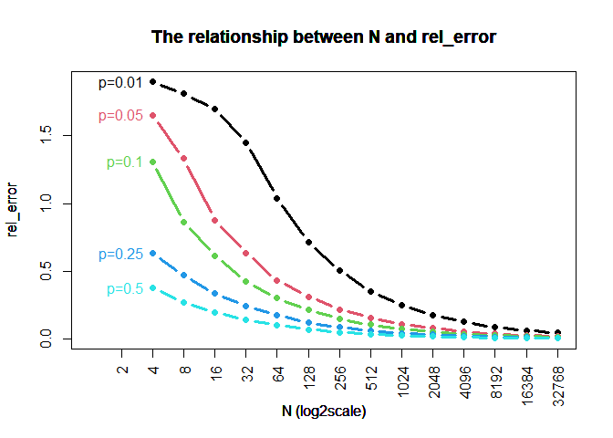
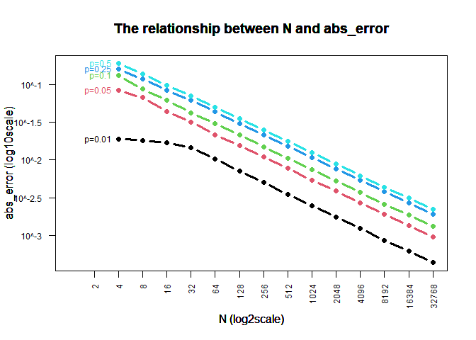

Monte Carlo Simulation
================
Jingyuan Wu
9/10/2021

``` r
library(dplyr)
```

    ## 
    ## 载入程辑包：'dplyr'

    ## The following objects are masked from 'package:stats':
    ## 
    ##     filter, lag

    ## The following objects are masked from 'package:base':
    ## 
    ##     intersect, setdiff, setequal, union

``` r
library(tidyverse)
```

    ## -- Attaching packages --------------------------------------- tidyverse 1.3.1 --

    ## v ggplot2 3.3.5     v purrr   0.3.4
    ## v tibble  3.1.4     v stringr 1.4.0
    ## v tidyr   1.1.3     v forcats 0.5.1
    ## v readr   2.0.1

    ## -- Conflicts ------------------------------------------ tidyverse_conflicts() --
    ## x dplyr::filter() masks stats::filter()
    ## x dplyr::lag()    masks stats::lag()

``` r
#library(rlang)
```

``` r
#' Commands repeated on each list element
#' 
#' Repeats a set of commands for each element of a list.  The commands are executed within the \code{with} command, so that variable names need not be quoted.
#' @param l A list.  Each element of the list is a data.frame.
#' @param ... A set of commands to be executed
#' @keywords lwith
#' @seealso \code{\link{with}}
#' @export
#' @examples
#' iris %>% 
#'   split(.$Species) %>% 
#'   lwith({plot(Sepal.Length, Sepal.Width, main = Species[1])})

lwith <- function(l, ...) lapply(l, function(x, ...){with(x, ...)}, ... )
```

``` r
#' Setup a plot
#' 
#' Sets up a plot based on variables in a dataset.  The intended use is for chained/piped commands.  Returns the same dataset that was passed in.
#' @param d A data.frame.
#' @param f Optional. A formula y ~ x. The limits of the plot region is calculated from the range of y and x.
#' @param xlim Optional. A 2 element vector, the limits of the x axis.
#' @param ylim Optional. A 2 element vector, the limits of the y axis.
#' @param log,asp,xaxs,yaxs Optional. Options sent in the plot.window command 
#' @param ... Optional. Options sent to the par command
#' @keywords plot_setup
#' @export
#' @examples
#' iris %>% 
#'   plot_setup(Sepal.Length~Sepal.Width) %>% 
#'   split(.$Species) %>% 
#'   lwith({
#'     l1 <- lm(Sepal.Length~Sepal.Width)
#'     lines(Sepal.Width, predict(l1))
#'   })
#'   

plot_setup <- function(d, f, xlim = NULL, ylim = NULL, log = "", asp = NA, xaxs = "r", yaxs = "r", ...){
  #browser()
  if(is.null(f)){
    v <- 1:4; dim(v) <- c(2,2)
  }else{
    v <- model.frame(f, data = d) %>% apply(2, range)  
  }
  
  if(is.null(xlim)) xlim <- v[,2]
  if(is.null(ylim)) ylim <- v[,1]
  plot.new()
  par(...)
  plot.window(xlim = xlim, ylim = ylim, log = log, asp = asp, xaxs = xaxs, yaxs = yaxs)
  d
}
```

# Introduction

This blog is going to show the relationship between the number of
replicates and simulation error by Monte Carlo simulation. Intuitively,
it seems that the degree of error should get smaller as the number of
simulation replicates increases. Simulation will be used in this blog to
generate approximate answers to explore if there is an error and what is
the degree of this error.

# Monte Carlo Simulation

Monte Carlo simulation is a simulation implemented thousands of times on
a computer. The computer model will randomly select any value in the
estimation interval for each input, and finally obtain a cumulative
probability distribution through a large number of simulations.

# Key Concepts

Absolute error is the absolute value of the difference between the
measured value and the true value. It shows the uncertainty or
inaccuracy of a measurement, which is expressed in the relevant units.

Relative error refers to the ratio between the absolute error and the
true value. In general, the relative error can better reflect the
credibility of the measurement.

Absolute error cannot be avoided, while relative error can be minimized.
Absolute error can indicate the reliability of a measurement, while
relative error can compare the reliability of different measurements.

# Application

A 14 X 5 factorial experiment simulation will be used to estimate the
error for each combination of replicate number (2^2, 2^3, …, 2^15) and
probability (0.01, 0.05, 0.10, 0.25, 0.50). Let p̂ denote the probability
estimated from simulation, and let p denote the true underlying
probability. Calculate error as

absolute error = \|p̂−p\|

and

relative error = \|p̂−p\|/p.

## Parameters and Starting Values

The simulation starts with creating an output grid. Then, a for loop is
applied to simulate random number generation. The parameters and their
starting values are listed below.

``` r
output <- expand.grid(
  N = 2^c(2:15), 
  P = c(0.01, 0.05, 0.10, 0.25, 0.50), 
  abs_error = NA, 
  rel_error = NA, 
  KEEP.OUT.ATTRS = FALSE)

r <- 10000
for(i in 1:nrow(output)){
  p <- output$P[i]
  n <- output$N[i]
  phat <- rbinom(r,n,p)/n
  output[i, "abs_error"] <- mean(abs(phat-p))
  output[i, "rel_error"] <- mean(abs(phat-p)/p)
}
```

Output grid:  
N: sample size to be replicated for each probability, (2^2, 2^3, …,
2^15)  
P: probabilities to be replicated for each sample size, (0.01, 0.05,
0.10, 0.25, 0.50)  

For loop:  
r: times of simulations, 10000  
p: unit probability (true value), from P  
n: unit sample size, from N  
phat: unit probability estimated from simulation, randomly generated
based on r, p, n  
abs\_error: average absolute error between estimated values and true
values  
rel\_error: average relative error between abs\_errors and true values  

## Simulation with the x-axis on the log2 scale

``` r
#the relationship between abs_error and log2(N)
output %>%
   mutate(x = log2(N)) %>%
   mutate(col = as.factor(P) %>% as.numeric) %>%
   #plotstyle(upright) %>%
   plot_setup(abs_error ~ x, c(0, 15)) %>%
   split(.$P) %>%
   lwith({
     lines(x, abs_error, col = col[1], lwd = 3, type = "b", pch = 16)
     text(x[1], abs_error[1], paste0("p=", P[1]), pos = 2, col=col[1])
     title(main = "The relationship between N and abs_error", xlab = "N (log2scale)", ylab = "abs_error")
   })
```

    ## $`0.01`
    ## NULL
    ## 
    ## $`0.05`
    ## NULL
    ## 
    ## $`0.1`
    ## NULL
    ## 
    ## $`0.25`
    ## NULL
    ## 
    ## $`0.5`
    ## NULL

``` r
axis(2)
axis(1, at=c(1:15), labels=2^c(1:15), las=2)
box()
```

<!-- -->

The figure above shows that in this simulation, the relationship between
N and abs\_error is negative. The larger the sample size is, the smaller
the absolute error is. The results of different “p”s show the
reliability of the simulation.

``` r
#the relationship between rel_error and log2(N)
output %>%
   mutate(x = log2(N)) %>%
   mutate(col = as.factor(P) %>% as.numeric) %>%
   #plotstyle(upright) %>%
   plot_setup(rel_error ~ x, c(0, 15)) %>%
   split(.$P) %>%
   lwith({
     lines(x, rel_error, col = col[1], lwd = 3, type = "b", pch = 16)
     text(x[1], rel_error[1], paste0("p=", P[1]), pos = 2, col=col[1])
     title(main = "The relationship between N and rel_error", xlab = "N (log2scale)", ylab = "rel_error")
   })
```

    ## $`0.01`
    ## NULL
    ## 
    ## $`0.05`
    ## NULL
    ## 
    ## $`0.1`
    ## NULL
    ## 
    ## $`0.25`
    ## NULL
    ## 
    ## $`0.5`
    ## NULL

``` r
axis(2)
axis(1, at=c(1:15), labels=2^c(1:15), las=2)
box()
```

<!-- -->

The figure above shows that in this simulation, the relationship between
N and rel\_error is negative. The larger the sample size is, the smaller
the relative error is.

## Simulation with the x-axis on the log2 scale and the y-axis on the log10 scale

The figures below are with the x-axis on the log2 scale and the y-axis
on the log10 scale in order to clarify such negative relationships
between N and abs\_error, N and rel\_error more clearly.

``` r
#the relationship between log10(abs_error) and log2(N)
output %>%
   mutate(x = log2(N)) %>%
   mutate(abs_error = log10(abs_error)) %>%
   mutate(col = as.factor(P) %>% as.numeric) %>%
   #plotstyle(upright) %>%
   plot_setup(abs_error ~ x, c(0, 15)) %>%
   split(.$P) %>%
   lwith({
     lines(x, abs_error, col = col[1], lwd = 3, type = "b", pch = 16)
     text(x[1], abs_error[1], paste0("p=", P[1]), pos = 2, col=col[1])
     title(main = "The relationship between N and abs_error", xlab = "N (log2scale)", ylab = "abs_error (log10scale)")
   })
```

    ## $`0.01`
    ## NULL
    ## 
    ## $`0.05`
    ## NULL
    ## 
    ## $`0.1`
    ## NULL
    ## 
    ## $`0.25`
    ## NULL
    ## 
    ## $`0.5`
    ## NULL

``` r
axis(2, at=c(-3,-2.5,-2,-1.5,-1,-0.5), labels=c("10^-3","10^-2.5","10^-2","10^-1.5","10^-1","10^-0.5"), las=2, cex.axis=.75)
axis(1, at=c(1:15), labels=2^c(1:15), las=2, cex.axis=.75)
box()
```

<!-- -->

This figure almost shows the negative linear relationship between N and
abs\_error.

``` r
#the relationship between rel_error and N at the scale of y=log10(rel_error) and x=log2(N)
output %>%
   mutate(x = log2(N)) %>%
   mutate(rel_error = log10(rel_error)) %>%
   mutate(col = as.factor(P) %>% as.numeric) %>%
   #plotstyle(upright) %>%
   plot_setup(rel_error ~ x, c(0, 15)) %>%
   split(.$P) %>%
   lwith({
     lines(x, rel_error, col = col[1], lwd = 3, type = "b", pch = 16)
     text(x[1], rel_error[1], paste0("p=", P[1]), pos = 2, col=col[1], cex=.75)
     title(main = "The relationship between N and rel_error", xlab = "N (log2scale)", ylab = "rel_error (log10scale)")
   })
```

    ## $`0.01`
    ## NULL
    ## 
    ## $`0.05`
    ## NULL
    ## 
    ## $`0.1`
    ## NULL
    ## 
    ## $`0.25`
    ## NULL
    ## 
    ## $`0.5`
    ## NULL

``` r
axis(2, at=c(-2,-1.5,-1,-0.5,0), labels=c("10^-2","10^-1.5","10^-1","10^-0.5","10^0"), las=2, cex.axis=.75)
axis(1, at=c(1:15), labels=2^c(1:15), las=2, cex.axis=.75)
box()
```

<!-- -->

This figure almost shows the negative linear relationship between N and
rel\_error.

# Conclusion

Obviously, after plotting these four graphs above, the relationship
between then number of replicates and simulation error shows up. It
seems that the intuitive probability is reasonable. The degree of error
gets smaller as the number of simulation replicates increases. And there
is almost a negative linear correlation between the replicate number of
simulation and the degree of error when taking N on log2 scale and
abs\_error/rel\_error on log10 scale.

For the five “p”s, the smaller the probability of the true value is, the
smaller the absolute error is, while the greater the probability of the
true value is, the smaller the relative error is. When p=0.01, mean
absolute error takes the minimum. When p=0.5, mean relative error takes
the minimum.
