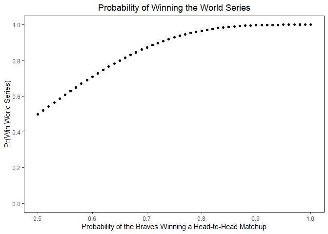
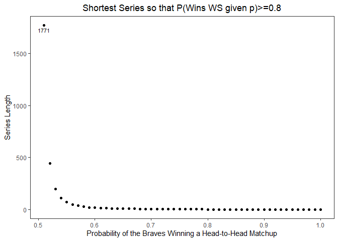

writeup
================
Jingyuan Wu
2021/9/26

## How often does the better team win the World Series?

### Introduction

World Series is a best-of-7 match-up between the champions of the
American and National Leagues of Major League Baseball. This blog is
going to explain the probability calculation problems related to World
Series.

### Setup

Suppose that the Braves and the Yankees are teams competing in World
Series.

Suppose that in any given game, the probability that the Braves wins is
PB and the probability that the Yankees wins is PY = 1 − PB.

### Assumptions

The result of each game is independent.

The result of each game is either a win or a loss, no tie.

When it comes to best-of-X series, X should be odd.

The team that wins World Series must win the last game.

### Q1 What is the probability that the Braves win the World Series given that PB = 0.55?

#### Setup for Q1

The probability that the Braves wins in any given game is 0.55.

Since it is a best-of-7 match-up, the Braves must win 4 games to win the
series and could end the series at the 4th or 5th or 6th or 7th game.
For each combination of wins and losses, the Braves must win the last
game.

If the series ends in the 4th game, the Braves must win all 4 games and
loose 0 game.

If the series ends in the 5th game, the Braves must win the last game
and any 3 other games before, and can loose any 1 game before the last
game.

If the series ends in the 6th game, the Braves must win the last game
and any 3 other games before, and can loose any 2 games before the last
game.

If the series ends in the 7th game, the Braves must win the last game
and any 3 other games before, and can loose any 3 game before the last
game.

The combinations and their probabilities are shown below.

| End\_n | losses |   probability    |
|:------:|:------:|:----------------:|
|   4    |   0    | dnbinom(0,4,.55) |
|   5    |   1    | dnbinom(1,4,.55) |
|   6    |   2    | dnbinom(2,4,.55) |
|   7    |   3    | dnbinom(3,4,.55) |

The probability that the Braves wins the World Series given that
PB = 0.55:
*d**n**b**i**n**o**m*(0, 4, .55) + *d**n**b**i**n**o**m*(1, 4, .55) + *d**n**b**i**n**o**m*(2, 4, .55) + *d**n**b**i**n**o**m*(3, 4, .55) = *p**n**b**i**n**o**m*(3, 4, .55)

``` r
library(ggplot2)
library(tidyverse)
```

    ## -- Attaching packages --------------------------------------- tidyverse 1.3.1 --

    ## v tibble  3.1.4     v dplyr   1.0.7
    ## v tidyr   1.1.3     v stringr 1.4.0
    ## v readr   2.0.1     v forcats 0.5.1
    ## v purrr   0.3.4

    ## -- Conflicts ------------------------------------------ tidyverse_conflicts() --
    ## x dplyr::filter() masks stats::filter()
    ## x dplyr::lag()    masks stats::lag()

``` r
pnbinom(3,4,.55)
```

    ## [1] 0.6082878

The probability that the Braves wins the World Series given that
PB = 0.55 is 0.61.

### Q2 What is the probability that the Braves win the World Series given that PB = x? This will be a figure (see below) with PB on the x-axis and P(Braves win World Series) on the y-axis.

#### Setup for Q2

The probability that the Braves wins in any given game is x. x: \[0.5,
1\], break=0.01.

As it is still a best-of-7 match-up, the calculation formula remains
unchanged, except that the probability that the Braves wins in any given
game turns to x.

``` r
x=seq(0.5, 1, 0.01)
y=pnbinom(3,4,x)
data <- data.frame(x,y)
data %>% ggplot(aes(x, y)) +
   geom_point() +
   #ylim(0,1) +
   scale_y_continuous(limit=c(0,1),breaks = seq(0, 1, .2)) +
   labs(x="Probability of the Braves Winning a Head-to-Head Matchup", y="Pr(Win World Series)", title="Probability of Winning the World Series") +
   theme_bw()  +
   theme(plot.title = element_text(hjust = 0.5), panel.grid.major=element_blank(), panel.grid.minor = element_blank())
```

<!-- -->

The graph above shows the relationship between
`Probability of the Braves Winning a Head-to-Head Matchup` and
`Pr(Win World Series)`. The higher the
`Probability of the Braves Winning a Head-to-Head Matchup` is, the
higher `Pr(Win World Series)` is.

### Q3 Suppose one could change the World Series to be best-of-9 or some other best-of-X series. What is the shortest series length so that P(Braves win World Series\|PB = .55) ≥ 0.8

#### Setup for Q3

The probability that the Braves wins in any given game is 0.55.

This time World Series will be a best-of-X series. X is changing from 1
to 99 and breaking in 2. A for loop is set for X to find the shortest
series length. While P(Braves win World Series\|PB = .55) ≥ 0.8, the for
loop breaks and outputs the shortest series length.

The calculation formula remains unchanged. `ceiling()` function is used
for returning the smallest integer that is greater than or equal to the
value passed to it as argument, which is in order to find the
`losses at most` of winning a best-of-X series.

``` r
X=99 #X should be odd.
Z=0
Y <- vector()
for (i in seq(1,X,2)){
  Y[i]=pnbinom(ceiling(i/2)-1, ceiling(i/2), .55)
  if (Y[i]>=0.8){
    Z=i
    break
  }
}
Z
```

    ## [1] 71

The shortest series length given P(Braves win World
Series\|PB = .55) ≥ 0.8 is 71.

### Q4 What is the shortest series length so that P(Braves win World Series\|PB = x) ≥ 0.8? This will be a figure (see below) with PB on the x-axis and series length is the y-axis.

#### Setup for Q4

The probability that the Braves wins in any given game is m. m: \[0.5,
1\], break=0.01.

This time World Series will be a best-of-q series. q should be odd.

The calculation formula remains unchanged, except that the probability
that the Braves wins in any given game turns to `m[j]`, the Braves at
most loses `[ceiling(q[i]/2)-1]` games.

`t[j]` is the shortest length of series that Braves wins World Series
given `m[j]`.

Double for loop is set for iterations of
`Probability of the Braves Winning a Head-to-Head Matchup` and
`Series Length`.

``` r
m=seq(0.5, 1, 0.01)
q=seq(1, 9999, 2) #q should be odd.
t=rep(NA, length(m))
s=rep(NA, length(q))
for (j in 1:length(m)){
  for (i in 1:length(q)){
    r=pnbinom(ceiling(q[i]/2)-1, ceiling(q[i]/2), m[j])
  if(r>=0.8){
    s=q[i]
    break
  }
}
t[j]=s
}
```

    ## Warning in t[j] <- s: 被替换的项目不是替换值长度的倍数

``` r
t
```

    ##  [1]   NA 1771  443  197  111   71   49   37   27   21   17   15   13   11    9
    ## [16]    7    7    7    5    5    5    5    3    3    3    3    3    3    3    3
    ## [31]    1    1    1    1    1    1    1    1    1    1    1    1    1    1    1
    ## [46]    1    1    1    1    1    1

``` r
data1=data.frame(m, t)
#sum(is.na(data1))
max <- data1 %>% na.omit() %>% filter(t==max(t))
#max
data1 %>% na.omit() %>% ggplot(aes(m, t)) +
   geom_point() +
   labs(x="Probability of the Braves Winning a Head-to-Head Matchup", y="Series Length", title="Shortest Series so that P(Wins WS given p)>=0.8") +
   theme_bw() +
   theme(plot.title = element_text(hjust = 0.5), panel.grid.major=element_blank(), panel.grid.minor = element_blank()) +
   geom_text(data=max, label=max$t, vjust=1.5, size=3)
```

<!-- -->

The graph above shows the relationship between
`Probability of the Braves Winning a Head-to-Head Matchup` and
`Series Length`. The higher the
`Probability of the Braves Winning a Head-to-Head Matchup` is, the
shorter `Series Length` is.

### Q5 Calculate P(PB = 0.55\|Braves win World Series in 7 games) under the assumption that either PB = 0.55 or PB = 0.45. Explain your solution.

#### Setup for Q5

A = {PB = 0.55}

B = {Braves win World Series in 7 games}

C = {PB = 0.45}

According to `Bayes Rules`,
$$P(A\|B) = \\frac{P(B\|A)P(A)}{P(B)}$$

As there are two possible PB listed in Q5, it is easy to find that:
*P*(*A*) = *P*(*C*) = 0.5

According to the Law of Total Probability:
*P*(*B*) = *P*(*B*\|*A*) + *P*(*B*\|*C*)

*P*(*B*) = *d**n**b**i**n**o**m*(3, 4, .55) \* .5 + *d**n**b**i**n**o**m*(3, 4, .45)\] \* .5

When calculating the probability of the Braves wins World Series in 7
games given the probability that the Braves wins in any given game is
0.55, it is obvious that the Braves wins the last game of the best-of-7
match-up and loses any 3 of the previous games. As a result,
*P*(*B*\|*A*) = *d**n**b**i**n**o**m*(3, 4, .55)

$$P(A\|B) = \\frac{P(B\|A)P(A)}{P(B)} = \\frac{dnbinom(3,4,.55)\*0.5}{dnbinom(3,4,.55) \*.5 + dnbinom(3,4,.45)\*0.5}$$

``` r
pb<-dnbinom(3,4,.55)*.5+dnbinom(3,4,.45)*.5 #P(Braves win World Series in 7 games)
pba=dnbinom(3,4,.55) #P(Braves win World Series in 7 games|P_B=0.55)
pa=.5 #P(P_B=0.55)
pab=pba*pa/pb
pab #Answer
```

    ## [1] 0.55

P(PB = 0.55\|Braves win World Series in 7 games) under the assumption
that either PB = 0.55 or PB = 0.45 is 0.55.
