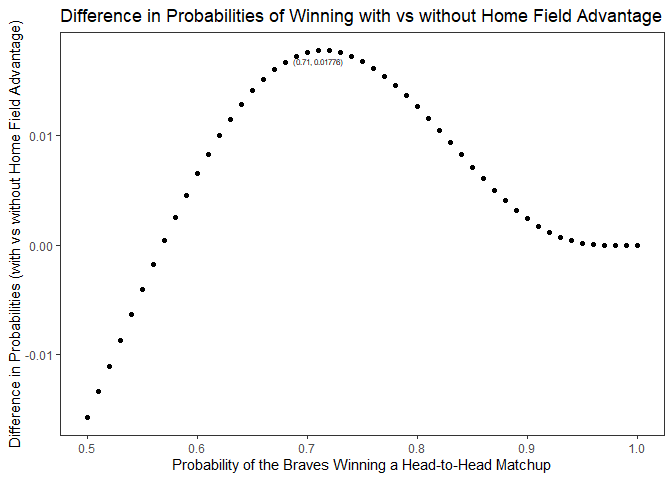
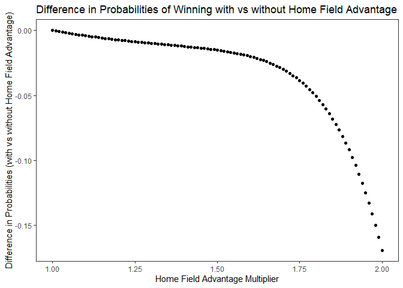

writeup
================
Jingyuan Wu
2021/10/1

## World Series Home Field

The World Series is a first-to-4-wins match-up between the champions of
the American and National Leagues of Major League Baseball. This blog is
going to follow the previous one to continue to explain the probability
calculation problems related to World Series with or without home filed
advantage.

The home field advantage is the edge which a team may have when playing
a game at its home stadium. For example, it is the edge the Braves may
have over the Yankees when the head-to-head match-up is in Atlanta. It
is the advantage the Yankees may have when the head-to-head match-up is
in New York.

If home field advantage exists, how much of an impact does it have on
winning the World Series?

### Setup:

-   Suppose that the Braves and the Yankees are teams competing in the
    World Series.

-   The table below has the two possible schedules for each game of the
    series. (NYC = New York City, ATL = Atlanta)

| Overall advantage | Game 1 | Game 2 | Game 3 | Game 4 | Game 5 | Game 6 | Game 7 |
|:-----------------:|:------:|:------:|:------:|:------:|:------:|:------:|:------:|
|      Braves       |  ATL   |  ATL   |  NYC   |  NYC   |  NYC   |  ATL   |  ATL   |
|      Yankees      |  NYC   |  NYC   |  ATL   |  ATL   |  ATL   |  NYC   |  NYC   |

-   Let *P*<sub>*B*</sub> be the probability that the Braves win a
    single head-to-head match-up with the Yankees, under the assumption
    that home field advantage doesn’t exist. Let
    *P*<sub>*B*</sub><sup>*H*</sup> denote the probability that the
    Braves win a single head-to-head match-up with the Yankees as the
    home team (H for home). Let *P*<sub>*B*</sub><sup>*A*</sup> denote
    the probability that the Braves win a single head-to-head match-up
    with the away team (A for away).

| Game location |   No advantage    | Advantage                                                            |
|:-------------:|:-----------------:|:---------------------------------------------------------------------|
|      ATL      | *P*<sub>*B*</sub> | *P*<sub>*B*</sub><sup>*H*</sup> = *P*<sub>*B*</sub> \* 1.1           |
|      NYC      | *P*<sub>*B*</sub> | *P*<sub>*B*</sub><sup>*A*</sup> = 1 − (1 − *P*<sub>*B*</sub>) \* 1.1 |

### Assumptions

The result of each game is either a win or a loss, no tie.

In any given game, the probability that the Braves wins is
*P*<sub>*B*</sub> and the probability that the Yankees wins is
*P*<sub>*Y*</sub> = 1 − *P*<sub>*B*</sub>.

### Q1: Compute analytically the probability that the Braves win the world series when the sequence of game locations is {NYC, NYC, ATL, ATL, ATL, NYC, NYC}. (The code below computes the probability for the alternative sequence of game locations. Note: The code uses data.table syntax, which may be new to you. This is intentional, as a gentle way to introduce data.table.) Calculate the probability with and without home field advantage when PB = 0.55. What is the difference in probabilities?

First, list a table of all combinations that the Braves wins the World
Series in 7 games. The first few rows of the table are shown below.

``` r
library(tidyverse)
```

    ## -- Attaching packages --------------------------------------- tidyverse 1.3.1 --

    ## v ggplot2 3.3.5     v purrr   0.3.4
    ## v tibble  3.1.4     v dplyr   1.0.7
    ## v tidyr   1.1.3     v stringr 1.4.0
    ## v readr   2.0.1     v forcats 0.5.1

    ## -- Conflicts ------------------------------------------ tidyverse_conflicts() --
    ## x dplyr::filter() masks stats::filter()
    ## x dplyr::lag()    masks stats::lag()

``` r
require(dplyr)
require(data.table)
```

    ## 载入需要的程辑包：data.table

    ## 
    ## 载入程辑包：'data.table'

    ## The following objects are masked from 'package:dplyr':
    ## 
    ##     between, first, last

    ## The following object is masked from 'package:purrr':
    ## 
    ##     transpose

``` r
# Get all possible outcomes
apo <- fread("all-possible-world-series-outcomes.csv")
head(apo)
```

    ##    game_1 game_2 game_3 game_4 game_5 game_6 game_7 overall_outcome
    ## 1:      W      W      W      W                                    W
    ## 2:      W      W      W      L      W                             W
    ## 3:      W      W      L      W      W                             W
    ## 4:      W      L      W      W      W                             W
    ## 5:      L      W      W      W      W                             W
    ## 6:      W      W      W      L      L      W                      W

Setup for Q1

The probability that the Braves wins in any given game without home
filed advantage is 0.55.

As the sequence of game locations is {NYC, NYC, ATL, ATL, ATL, NYC,
NYC}, set **hfi &lt;- c(0,0,1,1,1,0,0)**, 0 for NYC, 1 for ATL.

`advantage_multiplier` stands for the coefficient with home filed
advantage, which is 1.1.

``` r
# Home field indicator
hfi <- c(0,0,1,1,1,0,0) # {NYC, NYC, ATL, ATL, ATL, NYC, NYC} Set 0 for NYC, 1 for ATL

# P_B
pb <- 0.55
advantage_multiplier <- 1.1 # Set = 1 for no advantage
pbh <- 0.55*advantage_multiplier
pba <- 1 - (1 - 0.55)*advantage_multiplier
```

The chunk below is going to calculate the probability of each possible
outcome in a `data.table` syntax. Double for loop is applied to iterate
the probability that the Braves wins the game depending on the location.
p stands for the probability that the Braves wins each game.

``` r
# Calculate the probability of each possible outcome
apo[, p := NA_real_] # Initialize new column in apo to store prob
for(i in 1:nrow(apo)){
  prob_game <- rep(1, 7)
  for(j in 1:7){
    p_win <- ifelse(hfi[j], pbh, pba)
    prob_game[j] <- case_when(
        apo[i,j,with=FALSE] == "W" ~ p_win
      , apo[i,j,with=FALSE] == "L" ~ 1 - p_win
      , TRUE ~ 1
    )
  }
  apo[i, p := prod(prob_game)] # Data.table syntax
}

# Sanity check: does sum(p) == 1?
#apo[, sum(p)] # This is data.table notation

# Probability of overall World Series outcomes with home advantage
ap_apo <- apo[, sum(p), overall_outcome] %>% filter(overall_outcome=="W")
ap_wha <- ap_apo$V1
ap_wha
```

    ## [1] 0.604221

Based on the analytic solution, the probability with home field
advantage when *P*<sub>*B*</sub> = 0.55 is 0.604221.

``` r
# Probability of the Braves winning World Series without home advantage
ap_woha <- pnbinom(3,4,.55)
ap_woha
```

    ## [1] 0.6082878

Based on the analytic solution, the probability without home field
advantage when *P*<sub>*B*</sub> = 0.55 is 0.6082878.

``` r
diff <- ap_wha-ap_woha
diff
```

    ## [1] -0.004066825

The difference in probabilities between with and without home filed
advantage is -0.004066825. Since the Braves’s home is ATL and the
sequence of game locations is {NYC, NYC, ATL, ATL, ATL, NYC, NYC}, it is
reasonable that the probability with home filed advantage is slightly
less than the probability without home filed advantage.

### Q2: Calculate the same probabilities as the previous question by simulation.

Setup for Q2

Same as Q1.

`times` is the number of simulations, which indicates that this
simulation will iterates 100000 times.

``` r
set.seed(1)
times <- 100000
overall_outcome <- rep(NA, times)
for (i in 1:length(overall_outcome)){
  outcome <- rep(NA,7)
  for(j in 1:length(outcome)){
    p_win <- ifelse(hfi[j], pbh, pba)
    outcome[j] <- rbinom(1,1,p_win)
    if(sum(outcome,na.rm=T)==4){
      break
    }
    else if(sum(outcome==0,na.rm=T)==4){
      break
    }
  }
  overall_outcome[i] <- ifelse(sum(outcome,na.rm=T)==4, 1, 0)
}
sp_wha <- mean(overall_outcome)
sp_wha
```

    ## [1] 0.60439

Based on the simulation solution, the probability with home field
advantage when *P*<sub>*B*</sub> = 0.55 is 0.60439.

``` r
set.seed(3)
times <- 100000
overall_outcome <- rep(NA, times)
for (i in 1:length(overall_outcome)){
  outcome <- rep(NA,7)
  for(j in 1:length(outcome)){
    outcome[j] <- rbinom(1,1,pb)
    if(sum(outcome,na.rm=T)==4){
      break
    }
    else if(sum(outcome==0,na.rm=T)==4){
      break
    }
  }
  overall_outcome[i] <- ifelse(sum(outcome,na.rm=T)==4, 1, 0)
}
sp_woha <- mean(overall_outcome)
sp_woha
```

    ## [1] 0.60846

Based on the simulation solution, the probability without home field
advantage when *P*<sub>*B*</sub> = 0.55 is 0.60846.

### Q3: What is the absolute and relative error for your simulation in the previous question?

``` r
aerr_wha<- abs(ap_wha-sp_wha)
print(paste0("absolute error with home advantage = ",aerr_wha))
```

    ## [1] "absolute error with home advantage = 0.000169028386345471"

``` r
re_wha <- aerr_wha/ap_wha
print(paste0("relative error with home advantage = ",re_wha))
```

    ## [1] "relative error with home advantage = 0.000279745977525503"

In the simulation with home filed advantage, the absolute error is
0.000169, and the relative error is 0.000280.

``` r
aerr_woha<- abs(ap_woha-sp_woha)
print(paste0("absolute error without home advantage = ",aerr_woha))
```

    ## [1] "absolute error without home advantage = 0.00017220312499977"

``` r
re_woha <- aerr_woha/ap_woha
print(paste0("relative error without home advantage = ",re_woha))
```

    ## [1] "relative error without home advantage = 0.000283094821044317"

In the simulation without home filed advantage, the absolute error is
0.000172, and the relative error is 0.000283.

### Q4: Does the difference in probabilities (with vs without home field advantage) depend on PB? (Generate a plot to answer this question.)

Setup for Q4

Enumerate `pb` in the range of (0.5,1) with the break of 0.01.

The sequence of game locations is {NYC, NYC, ATL, ATL, ATL, NYC, NYC}.

`advantage_multiplier` is 1.1.

Triple for loop respectively iterates `pb`, the probability each game
that the Braves wins with home field advantage and 7 games.

`diff` is the difference between the probability with and without home
field advantage.

A plot will be generated below to show the relationship between
`Probability of the Braves Winning a Head-to-Head Matchup` and
`Difference in Probabilities (with vs without Home Field Advantage)`.

``` r
pb <- seq(0.5,1,0.01)
opwha <- rep(NA, length(pb))
opwoha <- rep(NA, length(pb))
diff <- rep(NA, length(pb))
for (k in seq_along(pb)) {
  advantage_multiplier <- 1.1
  pbh <- pb[k] * advantage_multiplier
  pba <- 1 - (1 - pb[k]) * advantage_multiplier
  opwoha[k] <- pnbinom(3, 4, pb[k])
  # Calculate the probability of each possible outcome
apo[, p := NA_real_] # Initialize new column in apo to store prob
for(i in 1:nrow(apo)){
  prob_game <- rep(1, 7)
  for(j in 1:7){
    p_win <- ifelse(hfi[j], pbh, pba)
    prob_game[j] <- case_when(
        apo[i,j,with=FALSE] == "W" ~ p_win
      , apo[i,j,with=FALSE] == "L" ~ 1 - p_win
      , TRUE ~ 1
    )
  }
  apo[i, p := prod(prob_game)] # Data.table syntax
  }
  opwha[k] <- unlist(apo[, sum(p), overall_outcome][1][,2])
  diff[k] <- opwha[k] - opwoha[k]
}
#diff
#plot(pb,diff)
q4 <- data.frame(pb,diff)
max <- q4 %>% na.omit() %>% filter(diff==max(diff))
q4 %>% ggplot(aes(pb, diff)) +
   geom_point() +
   labs(x="Probability of the Braves Winning a Head-to-Head Matchup", y="Difference in Probabilities (with vs without Home Field Advantage)", title="Difference in Probabilities of Winning with vs without Home Field Advantage") +
   theme_bw() +
   theme(panel.grid.major=element_blank(), panel.grid.minor = element_blank()) +
   geom_text(data=max, label=paste0("(",max$pb,", ",round(max$diff,5), ")"), vjust=2, size=2)
```

<!-- -->

The graph above shows that there is a trend of first rising and then
falling. The difference in probabilities (with vs without home field
advantage) does depend on *P*<sub>*B*</sub>. When
*P*<sub>*B*</sub> = 0.71, the difference reaches maximum, which
approximately equals to 0.01776, which indicates that the home filed
advantage reaches most.

### Q5: Does the difference in probabilities (with vs without home field advantage) depend on the advantage factor? (The advantage factor in PBH and PBA is the 1.1 multiplier that results in a 10% increase for the home team. Generate a plot to answer this question.)

Setup for Q5

`pb` is 0.55.

Enumerate `advantage_multiplier` in the range of (1,2) with the break of
0.01.

Triple for loop respectively iterates `advantage_multiplier`, the
probability each game that the Braves wins with home field advantage and
7 games.

`diff` is the difference between the probability with and without home
field advantage.

A plot will be generated below to show the relationship between
`Home Field Advantage Multiplier` and
`Difference in Probabilities (with vs without Home Field Advantage)`.

``` r
advantage_multiplier <- seq(1,2,0.01)
opwha <- rep(NA, length(advantage_multiplier))
opwoha <- rep(NA, length(advantage_multiplier))
diff <- rep(NA, length(advantage_multiplier))
for (k in seq_along(advantage_multiplier)) {
  pb <- 0.55
  pbh <- pb * advantage_multiplier[k]
  pba <- 1 - (1 - pb) * advantage_multiplier[k]
  opwoha[k] <- pnbinom(3, 4, pb)
  # Calculate the probability of each possible outcome
apo[, p := NA_real_] # Initialize new column in apo to store prob
for(i in 1:nrow(apo)){
  prob_game <- rep(1, 7)
  for(j in 1:7){
    p_win <- ifelse(hfi[j], pbh, pba)
    prob_game[j] <- case_when(
        apo[i,j,with=FALSE] == "W" ~ p_win
      , apo[i,j,with=FALSE] == "L" ~ 1 - p_win
      , TRUE ~ 1
    )
  }
  apo[i, p := prod(prob_game)] # Data.table syntax
  }
  opwha[k] <- unlist(apo[, sum(p), overall_outcome][1][,2])
  diff[k] <- opwha[k] - opwoha[k]
}
#diff
#plot(advantage_multiplier,diff)
q5 <- data.frame(advantage_multiplier,diff)
q5 %>% ggplot(aes(advantage_multiplier, diff)) +
   geom_point() +
   labs(x="Home Field Advantage Multiplier", y="Difference in Probabilities (with vs without Home Field Advantage)", title="Difference in Probabilities of Winning with vs without Home Field Advantage") +
   theme_bw() +
   theme(panel.grid.major=element_blank(), panel.grid.minor = element_blank())
```

<!-- -->

The graph above shows a decreasing trend. The difference in
probabilities decreases as home field advantage multiplier increases. As
the Yankees has 4 home fields while the Braves has only 3, when home
field advantage multiplier increases, the Braves has less home filed
advantage over overall outcomes.
