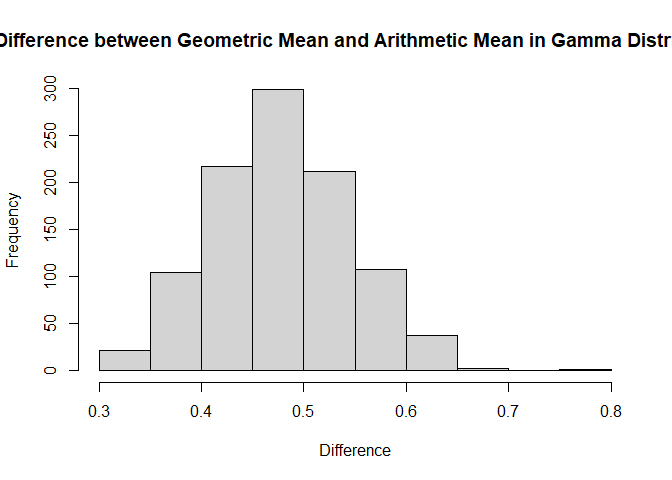
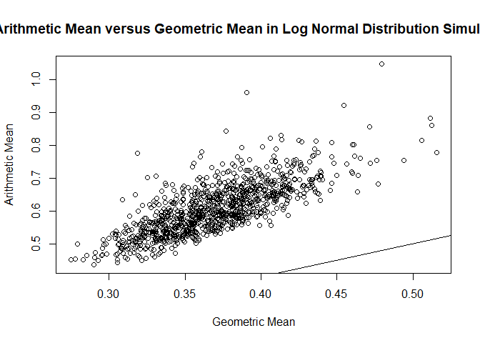

writeup
================
Jingyuan Wu
2021/10/8

## Log transform

## Part1

For each distribution below, generate a figure of the PDF and CDF. Mark
the mean and median in the figure.

For each distribution below, generate a figure of the PDF and CDF of the
transformation Y = log(X) random variable. Mark the mean and median in
the figure. You may use simulation or analytic methods in order find the
PDF and CDF of the transformation.

For each of the distributions below, generate 1000 samples of size 100.
For each sample, calculate the geometric and arithmetic mean. Generate a
scatter plot of the geometic and arithmetic sample means. Add the line
of identify as a reference line.

Generate a histogram of the difference between the arithmetic mean and
the geometric mean.

``` r
library(tidyverse)
library(ggplot2)
```

### X ∼ GAMMA(shape = 3, scale = 1)

For Question 1, it is going to draw a PDF and CDF figures of the given
Gamma distribution based on the randomly generated x.

Assumption:

1.  The intervals over which the events occur do not overlap.

2.  The events are independent.

3.  The probability that more than one event happens in a very short
    time period is approximately 0.

4.  Two variables shape and scale/rate are all greater than 0.

The mean, in other words, the expected value of gamma distribution can
be calculated by multiplying shape by scale. In this distribution, it
will be
*E*(*x*) = 3 \* 1 = 3

The median can be generated through the function `qgamma()`, while q =
0.5.

`dgamma()` function is used to find the value of the density function of
a gamma distribution with certain shape and rate parameters.

`pgamma()` function is used to find the value of the cumulative density
function of a gamma distribution with certain shape and rate parameters.

x is a 100-vector list randomly generated with `seq()` function from 0
to 10.

After using `dgamma()` and `pgamma()` functions to generate PDF and CDF
of X \~ Gamma(3,1), the plots are shown below.

``` r
#X ~ Gamma(3,1)
#Gamma Q1
g_mean <- 3*1
g_median <- qgamma(.5, shape=3, scale=1)

#Gamma PDF
x <- seq(0, 10, length.out=100)
y <- dgamma(x, shape=3, scale=1)
plot(x, y, type="l", main = "Probability Density Function of Gamma Distribution", xlab="x", ylab="", xlim=c(floor(min(x)),ceiling(max(x))))
abline(v = g_median, col = "green")
abline(v = g_mean, col = "purple", lty=3)
legend("topright", c("Median","Mean"), col = c("green","purple"), lty=c(1,3), bty = "n", cex=.8)
```

<!-- -->

``` r
#Gamma CDF
z <- pgamma(x, shape=3, scale=1)
plot(x, z, type="l", main = "Cumulative Distribution Function of Gamma Distribution", xlab="x", ylab="", xlim=c(floor(min(x)),ceiling(max(x))))
abline(v = g_median, col = "green")
abline(v = g_mean, col = "purple", lty=3)
legend("bottomright", c("Median","Mean"), col = c("green","purple"), lty=c(1,3), bty = "n", cex=.8)
```

<!-- -->

For PDF of Gamma distribution, it shows a trend of starting from 0,
first rising, then falling, and approaching 0. As the shape = 3, PDF is
a unimodal function.

For CDF of Gamma distribution, it shows a monotonous increasing trend
from infinitely close to 0 to infinitely close to 1.

In both graphs, median is less than mean.

Similar to Q1, this question is going to generate a series of x with the
transformation of Y = log(X), X &gt;0, use `density()` and `ecdf()` to
generate PDF and CDF, then plot them.

``` r
#Gamma Q2
g2_one_series <- function(times, shape, scale){
  o <- rgamma(times, shape, scale)
  p <- log(o)
  q <- density(p)
  r <- ecdf(p)
  plot(q, main = "PDF of the Transformation Y = log(X)", xlab = "x", ylab = "", xlim=c(floor(min(p)),ceiling(max(p))))
  abline(v = median(p), col = "green")
  abline(v = mean(p), col = "purple", lty=3)
  legend("topleft", c("Median","Mean"), col =       c("green","purple"), lty=c(1,3), bty = "n", cex = .8)
  
  plot(r, main = "CDF of the Transformation Y = log(X)", xlab = "x", ylab = "", xlim=c(floor(min(p)),ceiling(max(p))))
  abline(v = median(p), col = "green")
  abline(v = mean(p), col = "purple", lty=3)
  legend("topleft", c("Median","Mean"), col = c("green","purple"), lty=c(1,3), bty = "n", cex=.8)
}
g2_one_series(10000,3,1)
```

<!-- --><!-- -->

From the graphs above, they show that the log-transformation helps
correct a right-skewed distribution.

In both graphs, median is greater than mean.

``` r
gm_mean = function(x, na.rm=TRUE, zero.propagate = FALSE){
  if(any(x < 0, na.rm = TRUE)){
    return(NaN)
  }
  if(zero.propagate){
    if(any(x == 0, na.rm = TRUE)){
      return(0)
    }
    exp(mean(log(x), na.rm = na.rm))
  } else {
    exp(sum(log(x[x > 0]), na.rm=na.rm) / length(x))
  }
}
```

The chunk above defines the geometric mean, which does not own a
function in R. Several if-elses were used for different conditions of x.

``` r
#Gamma Q3
g3_one_series <- function(sample, size, shape, scale){
  gm <- rep(NA, length(sample))
  am <- rep(NA, length(sample))
  for (i in 1:sample){
    s <- rgamma(size, shape, scale)
    gm[i] <- gm_mean(s)
    am[i] <- mean(s)
  }
  plot(gm, am, xlab ="Geometric Mean",ylab = "Arithmetic Mean", main = "Arithmetic Mean versus Geometric Mean in Gamma Distribution Simulation")
  abline(coef=c(0,1))
}
g3_one_series(1000, 100, 3, 1)
```

<!-- -->

The chunk above uses a simulation solution for Question 3. It uses
`rgamma()` to generate a series samples and calculate their geometric
means abd arithmetic means. The graph above show the relationship
between the arithmetic mean and geometric mean in Gamma distribution. It
is almost parallel to the line: `coef=c(0,1)`.

``` r
#Gamma Q4
g4_one_series <- function(sample, size, shape, scale){
  gm <- rep(NA, length(sample))
  am <- rep(NA, length(sample))
  diff <- rep(NA, length(sample))
  for (i in 1:sample){
    s <- rgamma(size, shape, scale)
    gm[i] <- gm_mean(s)
    am[i] <- mean(s)
    diff[i] <- am[i] - gm[i]
  }
  hist(diff, xlab ="Difference", main = "Histogram of Difference between Geometric Mean and Arithmetic Mean in Gamma Distribution Simulation")
}
g4_one_series(1000, 100, 3, 1)
```

<!-- -->

The chunk above uses a simulation solution for Question 4. The solution
is same as Question3, while it generates a histogram to show the
difference between geometric mean and arithmetic mean in Gamma
distribution, which mainly distributes between 0.4 and 0.5.

### X ∼ LOG NORMAL(μ =  − 1, σ = 1)

Assumptions: The lognormal distribution is the discrete and ongoing
distribution of a random variable, the logarithm of which is normally
distributed. In other terms, lognormal distribution follows the concept
that instead of having the original raw data normally distributed, the
logarithms of this raw data that are computed are also normally
distributed.

A lognormal distribution is a result of the variable “x” being a product
of several variables that are identically distributed. It is common in
statistics that data be normally distributed for statistical testing.
The lognormal distribution can be converted to a normal distribution
through mathematical means and vice versa.

The lognormal distribution consists of only positive values and follows
the notation:

*l**n*(*x*1), *l**n*(*x*2), *l**n*(*x*3), ...
,

where the original variables are:

*x*1, *x*2, *x*3, ...

``` r
#X ~ Log Normal(-1,1)
#LN Q1
ln_mean = exp(-1+(1/2)*1^2)
ln_median = qlnorm(0.5, -1 , 1)

#LN PDF
x <- seq(0,4,length.out=100)
y <- dlnorm(x, -1, 1)
plot(x, y, type="l", main = "Probability Density Function of Log Normal Distribution", xlab="x", ylab="", xlim=c(floor(min(x)),ceiling(max(x))))
abline(v = ln_median, col = "green")
abline(v = ln_mean, col = "purple", lty=3)
legend("topright", c("Median","Mean"), col = c("green","purple"), lty=c(1,3), bty = "n", cex=.8)
```

<!-- -->

``` r
#LN CDF
z <- plnorm(x, -1, 1)
plot(x, z, type="l", main = "Cumulative Distribution Function of Log Normal Distribution", xlab="x", ylab="", xlim=c(floor(min(x)),ceiling(max(x))))
abline(v = ln_median, col = "green")
abline(v = ln_mean, col = "purple", lty=3)
legend("bottomright", c("Median","Mean"), col = c("green","purple"), lty=c(1,3), bty = "n", cex=.8)
```

<!-- -->

For PDF of Lognomal distribution, it shows a trend of starting from 0,
first rising, then falling, and approaching 0. PDF is a unimodal
function.

For CDF of Lognomal distribution, it shows a monotonous increasing trend
from infinitely close to 0 to infinitely close to 1.

In both graphs, median is less than mean.

``` r
#LN Q2
g2_one_series <- function(times, m, l){
  o <- rlnorm(times, m, l)
  p <- log(o)
  q <- density(p)
  r <- ecdf(p)
  plot(q, main = "PDF of the Transformation Y = log(X)", xlab = "x", ylab = "", xlim=c(floor(min(p)),ceiling(max(p))))
  abline(v = median(p), col = "green")
  abline(v = mean(p), col = "purple", lty=3)
  legend("topleft", c("Median","Mean"), col =       c("green","purple"), lty=c(1,3), bty = "n", cex = .8)
  
  plot(r, main = "CDF of the Transformation Y = log(X)", xlab = "x", ylab = "", xlim=c(floor(min(p)),ceiling(max(p))))
  abline(v = median(p), col = "green")
  abline(v = mean(p), col = "purple", lty=3)
  legend("bottomright", c("Median","Mean"), col = c("green","purple"), lty=c(1,3), bty = "n", cex=.8)
}
g2_one_series(10000,-1,1)
```

<!-- --><!-- -->

After log-transformation, for PDF of Lognormal distribution, it shows
like normal distribution. For CDF of Lognormal distribution, it is
sonotonically increasing.

In both graphs, median equals to mean.

``` r
#LN Q3
g3_one_series <- function(sample, size, m, l){
  gm <- rep(NA, length(sample))
  am <- rep(NA, length(sample))
  for (i in 1:sample){
    s <- rlnorm(size, m, l)
    gm[i] <- gm_mean(s)
    am[i] <- mean(s)
  }
  plot(gm, am, xlab ="Geometric Mean",ylab = "Arithmetic Mean", main = "Arithmetic Mean versus Geometric Mean in Log Normal Distribution Simulation")
  abline(coef=c(0,1))
}
g3_one_series(1000, 100, -1, 1)
```

<!-- -->

The chunk above uses a simulation solution for Question 3. It uses
`rlnorm()` to generate a series samples and calculate their geometric
means abd arithmetic means. The graph above show the relationship
between the arithmetic mean and geometric mean in Lognormal
distribution. It is almost parallel to the line: `coef=c(0,1)`.

``` r
#LN Q4
g4_one_series <- function(sample, size, m, l){
  gm <- rep(NA, length(sample))
  am <- rep(NA, length(sample))
  diff <- rep(NA, length(sample))
  for (i in 1:sample){
    s <- rlnorm(size, m, l)
    gm[i] <- gm_mean(s)
    am[i] <- mean(s)
    diff[i] <- am[i] - gm[i]
  }
  hist(diff, xlab ="Difference", main = "Histogram of Difference between Geometric Mean and Arithmetic Mean in Log Normal Distribution Simulation")
}
g4_one_series(1000, 100, -1, 1)
```

<!-- -->

The chunk above uses a simulation solution for Question 4. The solution
is same as Question3, while it generates a histogram to show the
difference between geometric mean and arithmetic mean in Lognormal
distribution, which mainly distributes between 0.2 and 0.3.

### X ∼ UNIFORM(0, 12)

Assumptions:

Minimum is fixed.

Maximum is fixed.

All values in range are equally likely to occur.

In this case,
*m**e**a**n* = *m**e**d**i**a**n* = (0 + 12) \* 0.5 = 6

``` r
#X ~ UNIFORM(0, 12)
#U Q1
u_mean = 6
u_median = qunif(0.5, 0, 12)

#U PDF
x = seq(0, 20, by = 0.01)
y <- dunif(x, 0, 12)
plot(x, y, type="l", main = "Probability Density Function of Uniform Distribution", xlab="x", ylab="", xlim=c(floor(min(x)),ceiling(max(x))))
abline(v = u_median, col = "green")
abline(v = u_mean, col = "purple", lty=3)
legend("topright", c("Median","Mean"), col = c("green","purple"), lty=c(1,3), bty = "n", cex=.8)
```

<!-- -->

``` r
#U CDF
z <- punif(x, 0, 12)
plot(x, z, type="l", main = "Cumulative Distribution Function of Uniform Distribution", xlab="x", ylab="", xlim=c(floor(min(x)),ceiling(max(x))))
abline(v = u_median, col = "green")
abline(v = u_mean, col = "purple", lty=3)
legend("bottomright", c("Median","Mean"), col = c("green","purple"), lty=c(1,3), bty = "n", cex=.8)
```

<!-- -->

For PDF of Uniform distribution, it shows an equal trend in the range of
x.

For CDF of Uniform distribution, it shows an increasing trend and
finally to 1.

In both graphs, median equals to mean.

``` r
#U Q2
g2_one_series <- function(times, m, l){
  o <- runif(times, m, l)
  p <- log(o)
  q <- density(p)
  r <- ecdf(p)
  plot(q, main = "PDF of the Transformation Y = log(X)", xlab = "x", ylab = "", xlim=c(floor(min(p)),ceiling(max(p))))
  abline(v = median(p), col = "green")
  abline(v = mean(p), col = "purple", lty=3)
  legend("topleft", c("Median","Mean"), col =       c("green","purple"), lty=c(1,3), bty = "n", cex = .8)
  
  plot(r, main = "CDF of the Transformation Y = log(X)", xlab = "x", ylab = "", xlim=c(floor(min(p)),ceiling(max(p))))
  abline(v = median(p), col = "green")
  abline(v = mean(p), col = "purple", lty=3)
  legend("topleft", c("Median","Mean"), col = c("green","purple"), lty=c(1,3), bty = "n", cex=.8)
}
g2_one_series(10000,0,12)
```

<!-- --><!-- -->

After log-transformation, the PDF of Uniform distribution seems a
unimodal function with skew, while th CDF of Unifrom distribution is
monotonically increasing

In both graphs, median is greater than mean.

``` r
#U Q3
g3_one_series <- function(sample, size, min, max){
  gm <- rep(NA, length(sample))
  am <- rep(NA, length(sample))
  for (i in 1:sample){
    s <- runif(size, min, max)
    gm[i] <- gm_mean(s)
    am[i] <- mean(s)
  }
  plot(gm, am, xlab ="Geometric Mean",ylab = "Arithmetic Mean", main = "Arithmetic Mean versus Geometric Mean in Uniform Distribution Simulation")
  abline(coef=c(0,1))
}
g3_one_series(1000, 100, 0, 12)
```

<!-- -->

The chunk above uses a simulation solution for Question 3. It uses
`runif()` to generate a series samples and calculate their geometric
means abd arithmetic means. The graph above show the relationship
between the arithmetic mean and geometric mean in Uniform distribution.
It is almost parallel to the line: `coef=c(0,1)`.

``` r
#U Q4
g4_one_series <- function(sample, size, min, max){
  gm <- rep(NA, length(sample))
  am <- rep(NA, length(sample))
  diff <- rep(NA, length(sample))
  for (i in 1:sample){
    s <- runif(size, min, max)
    gm[i] <- gm_mean(s)
    am[i] <- mean(s)
    diff[i] <- am[i] - gm[i]
  }
  hist(diff, xlab ="Difference", main = "Histogram of Difference between Geometric Mean and Arithmetic Mean in Uniform Distribution Simulation")
}
g4_one_series(1000, 100, 0, 12)
```

<!-- -->

The chunk above uses a simulation solution for Question 4. The solution
is same as Question3, while it generates a histogram to show the
difference between geometric mean and arithmetic mean in Unifrom
distribution, which mainly distributes around 1.5.

## Part2

Show that if Xi &gt; 0 for all i, then the arithmetic mean is greater
than or equal to the geometric mean.

Hint: Start with the sample mean of the transformation Yi = log (Xi).

Assumption:

X &gt; 0

Only if X &gt; 0, it can have the geometric mean.

``` r
p2_one_series <- function(sample, size){
    am <- rep(NA, length(sample))
    gm <- rep(NA, length(sample))
    diff <- rep(NA, length(sample))
    X = NA
  for (i in 1:size){
    X = sample(sample, size, replace = TRUE)
    gm[i] <- gm_mean(X)
    am[i] <- mean(X)
    diff[i]=am[i]-gm[i]
  }
  mean(diff)
}
p2_one_series(1000,100)
```

    ## [1] 129.0492

This chunk is using a simulation solution to generate X with `sample()`
with a for loop to iterate 1000 times with the size 100. `diff` stands
for the difference between the arithmetic mean and the geometric mean.
The output is the mean of `diff`, which is greater than 0. It shows that
if Xi &gt; 0 for all i, then the arithmetic mean is greater than the
geometric mean.

## Part 3

What is the correct relationship between E\[log (X)\] and log (E\[X\])?
Is one always larger? Equal? Explain your answer.

Assumption:

Given E\[log (X)\] and log (E\[X\]) exists,

X &gt; 0

``` r
p3_one_series <- function(sample, size){
    el <- rep(NA, length(sample))
    le <- rep(NA, length(sample))
    diff <- rep(NA, length(sample))
    X = NA
  for (i in 1:size){
    X = sample(sample, size, replace = TRUE)
    el[i]=mean(log(X))
    le[i]=log(mean(X))
    diff[i]=el[i]-le[i]
  }
  mean(diff)
}
p3_one_series(1000,100)
```

    ## [1] -0.2932305

This chunk is using a simulation solution to generate X with `sample()`
with a for loop to iterate 1000 times with the size 100. `diff` stands
for the difference between E\[log (X)\] and log (E\[X\]). The output is
the mean of `diff`, which is less than 0. It shows that E\[log (X)\] is
always less than log (E\[X\]).
