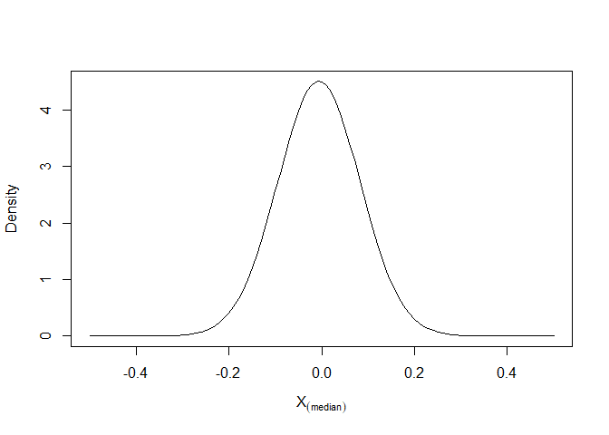
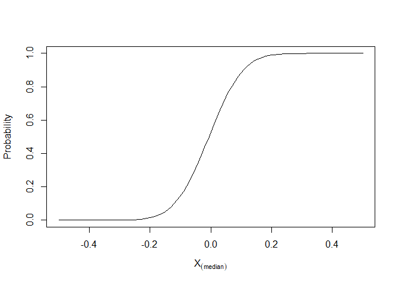
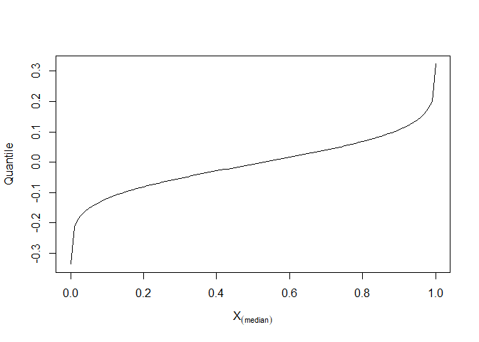
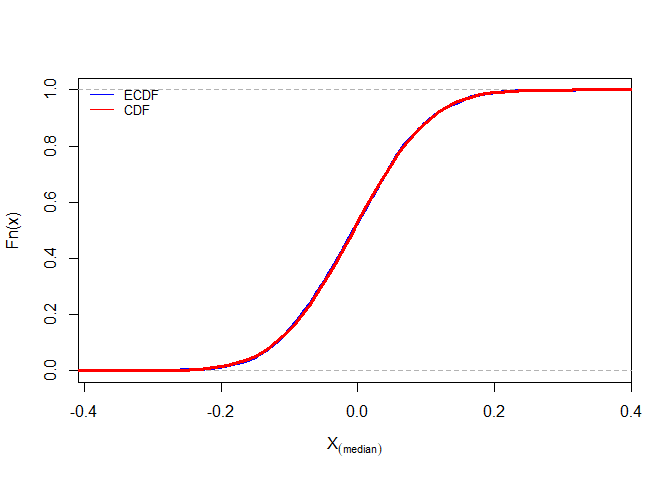
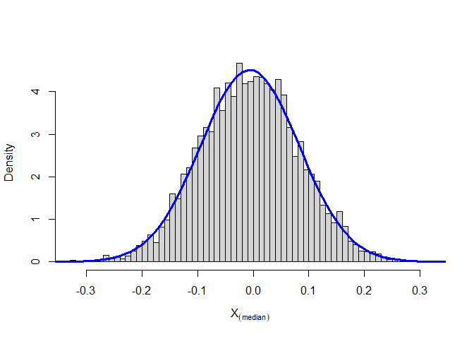
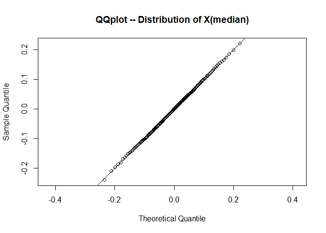
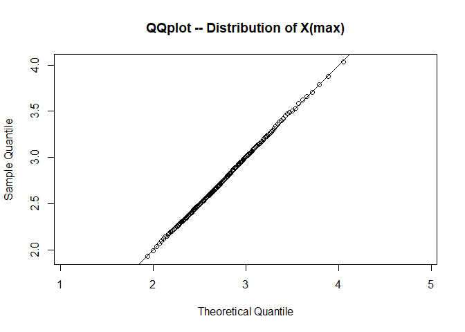
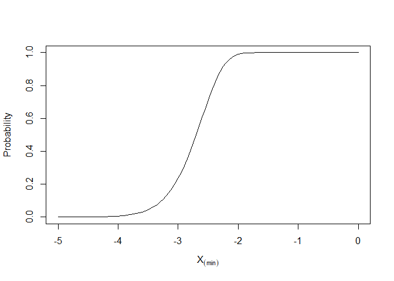
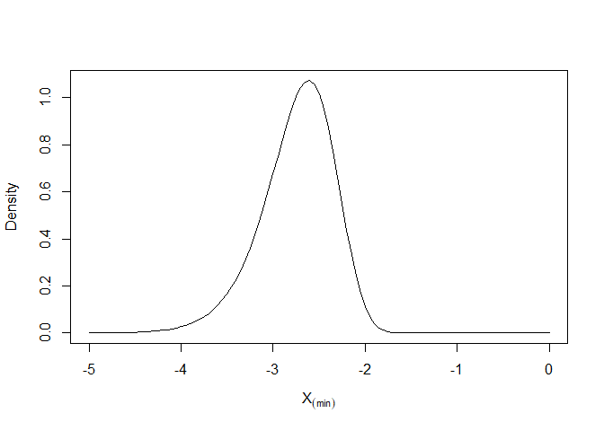

writeup
================
Jingyuan Wu
2021/10/22

## Which quantiles of a continuous distribution can one estimate with more precision?

``` r
library(tidyverse)
library(rlang)
```

The median is an important quantity in data analysis. It represents the
middle value of the data distribution. Estimates of the median, however,
have a degree of uncertainty because (a) the estimates are calculated
from a finite sample and (b) the data distribution of the underlying
data is generally unknown. This blog is going to explain a series of
questions related to the variation of the median (and a range of other
quantiles), quantify and communicate the degree of uncertainty in the
answers using analytic methods based on the definition of order
statistics. To clarify, this blog is going to focus on continuous
distribution.

## Order Statistics

Suppose that the random variables X1, X2, . . . , Xn constitute a sample
of size n from an infinite population with continuous density. Often
it’s useful to reorder these random variables in an ascending order
satisfying X1 ≤ X2 ≤ · · · ≤ Xn. In reordering the variables, rename
them so that Y1 is a random variable whose value is the smallest, Y2 is
the next smallest, and Yn is the largest. Yk is called the kth order
statistic of the sample.

### Q: Begin with the median from a sample of N = 200 from the standard normal distribution. Write an R function that is the density function for the median in this sample. Note that the 100th order statistic is approximately the median, and use the order statistic formula discussed in class. Generate a plot of the function.

Set up

Standard normal distribution is a normal distribution that mean=0, sd=1.

Sample size is 200.

The sample median will denote by 100, which is approximately half of the
200 observations. In other words, the 100th order statistic is
approximately the median in this question.

dorder stands for the density function for the median, which is
generated by built-in norm function based on the definition of order
statistics: *I**f**X**N* = *X*1, *X*2, …, *X**N*

*L**e**t**X*(*N*) = *s**o**r**t*(*X**N*)

*X*(*N*) = *X*(1), *X*(2), …, *X*(*N*)

``` r
dorder <- function(x){
  100*
  choose(200,100)*
  (pnorm(x))^(100-1)*
  (1-pnorm(x))^(200-100)*
  dnorm(x)
}
curve(dorder(x), -0.5, 0.5, xlab=parse(text="X[(median)]"), ylab = "Density")
```

<!-- -->

The plot above shows the distribution of X\[(median)\] in PDF. It shows
almost same as the distribution of X that the peak of the curve is
located in the center, where is the average. The curve is centered on
the mean and symmetrical. The two ends of the curve never intersect the
horizontal axis. The curve starts from the average, and gradually
decreases to both sides.

### Q: Write an R function that is the probability function for the median in this sample. Use the order statistic formula discussed in class. Generate a plot of the function.

porder stands for the probability function for the median, which is
sorted as 100th as the sample size is 200.

``` r
porder <- function(x){
  pbinom(100-1, 200, pnorm(x), lower.tail = FALSE)
}
curve(porder(x), -0.5, 0.5, xlab = parse(text="X[(median)]"), ylab = "Probability")
```

<!-- -->

The plot above shows the distribution of X\[(median)\] in CDF.

### Q: Write an R function that is the quantile function for the median in this sample. (You have several options for how to write this function.) Generate a plot of the function.

qorder stands for the quantile function for the median.

It can be a further generalization to split the distribution mentioned
above. Quantile is one of the class of values of a variate which divides
a probability distribution into distributions of equal probability. For
example, the median splits the data set in half, which is also 50th
percentile of a continuous distribution. In the following chunk, I
define the qorder function by finding the roots of the a given
quantile’s probability function (porder) using uniroot function. The
challenge is to define the left and right input of the uniroot function
by finding the intersection of CDF and the quantile (0.5, which stands
for the median, in this sample). Create a tmp function to take the
difference of CDF (porder in this sample), and the quantile p. Draw the
x-axis(x=0) to find the root. After finding the input interval for
uniroot function, I put all these in a for loop to write qorder
function.

``` r
#curve(porder, -0.5, 0.5)
#abline(h=0.5)
#tmp <- function(x,p){porder(x)-p}
#curve(tmp(x, 0.5), -0.5, 0.5)
#abline(h=0)
#uniroot(tmp,c(-0.5,0.5),p=0.5)

qorder <- function(p){
  tmp <- function(x, p){porder(x)-p}
  out <- p*0
  for (i in seq_along(p)){
    out[i] <- uniroot(tmp,c(-0.5,0.5),p=p[i])$root
  }
  out
}
#qorder(.5)
curve(qorder(x), 0.0001, 0.9999, xlab = parse(text="X[(median)]"), ylab = "Quantile")
```

<!-- -->

The plot above shows the distribution of the quantile function for the
median in the sample.

### Q: Simulate the sampling distribution for the median. Create a plot of the empirical CDF (ECDF). Overlay the plot of the ECDF with a plot of the CDF.

M stands for the simulation times. N stands for the sample size. m
stores a series of random numbers conforming to normal distribution. hun
stores a series median of m. Then use ecdf function to draw ECDF.
Overlay the CDF by plotting porder.

``` r
M <- 5000
N <- 200
m <- array(rnorm(M*N), c(M, N))
hun <- m %>% apply(1, function(x){sort(x)[100]})
ecdf <- ecdf(hun)
plot(ecdf, verticals = TRUE, do.points = FALSE, lwd = 3, main="", col="blue", xlab = parse(text="X[(median)]"))
curve(porder(x), -0.5, 0.5, add = TRUE, col = "red", lwd = 3)
legend("topleft", c("ECDF","CDF"), col = c("blue","red"), lty=c(1,1), bty = "n", cex=.8)
```

<!-- -->

The plot above shows the median’s ECDF in blue and CDF in red. There is
almost no deviation.

### Q: Using the simulated sampling distribution from the previous question, create a histogram (on the density scale). Overlay the histogram with a plot of the density function.

``` r
hist(hun, breaks = 50, freq = FALSE, main = "", xlab = parse(text="X[(median)]"))
curve(dorder(x), -0.5, 0.5, lwd = 3, add = TRUE, col = "blue")
```

<!-- -->

The histogram (on the density scale) above shows the distribution of
median in simulation method. A PDF is overlay.

### Q: For the assignment, generate a QQ plot for the simulated data of the median relative to the known sampling distribution of the median. Does the simulated data agree with the theoretical sampling distribution?

One very common way to compare a random sample to a theoretical
candidate distribution is the QQ plot. It is created by plotting
quantiles of the theoretical distribution on the x-axis and empirical
quantiles from the sample on the y-axis.

Randomly generate a series of numbers through qorder, which stand for
theoretical quantiles.

Take hun, what generated in the previous question, which stand for
sample quantile.

Take line y=x as a reference.

``` r
x <- qorder((1:199)/200)
y <- quantile(hun, probs = (1:199)/200)
qqplot(x, y, asp = 1, xlab = "Theoretical Quantile", ylab = "Sample Quantile", main = "QQplot -- Distribution of X(median)")
abline(0,1)
```

<!-- -->

The plot above compares the distribution of a random quantile candidate
to the distribution of a theoretical quantile candidate through a QQ
plot.

The plotted points almost fall along the line y = x, which shows sample
quantiles and theoretical quantiles come from the same distribution.

### Q: Modify the dorder, porder, and qorder functions so that the functions take a new parameter k (for the kt\*\*h order statistic) so that the functions will work for any order statistic and not just the median.

Add the parameter k standing for the kt\*\*h order statistic in the
three functions.

``` r
#dorder
dorder <- function(x, k){
  k*
  choose(200,k)*
  (pnorm(x))^(k-1)*
  (1-pnorm(x))^(200-k)*
  dnorm(x)
}

#porder
porder <- function(x, k){
  pbinom(k-1, 200, pnorm(x), lower.tail = FALSE)
}

#qorder
qorder <- function(p, k){
  tmp <- function(x, p){porder(x, k)-p}
  out <- p*0
  for (i in seq_along(p)){
    out[i] <- uniroot(tmp,c(-5, 10),p=p[i])$root
  }
  out
}
#dorder(1, 200)
#porder(1, 200)
#qorder(1, 200)
```

### Q: Generate the QQ plot for simulated data from the sampling distribution of the sample max and the theoretical largest order statistic distribution.

Similar to the previous QQ plot.

Change the number in sort function from 100 to 200 to find the
distribution of the sample max.

Change the quantile from median to max to find the theoretical largest
order statistic distribution.

Then, generate a QQ plot.

Take y=x as a reference.

``` r
#curve(porder(x, 200), -5, 10)
#abline(h=1)
#tmp <- function(x,p){porder(x, 200)-p}
#curve(tmp(x, 1), -5, 10)
#abline(h=0)
#uniroot(tmp,c(-5,10),p=1)
M <- 5000
N <- 200
m <- array(rnorm(M*N), c(M, N))
max <- m %>% apply(1, function(x){sort(x)[200]})

q_candidate <- function(p){
  tmp <- function(x, p){porder(x, 200)-p}
  out <- p*0
  for (i in seq_along(p)){
    out[i] <- uniroot(tmp,c(-5, 10),p=p[i])$root
  }
  out
}

x <- q_candidate((1:199)/200)
y <- quantile(max, probs = (1:199)/200)
qqplot(x, y, asp = 1, xlab = "Theoretical Quantile", ylab = "Sample Quantile", main = "QQplot -- Distribution of X(max)")
abline(0,1)
```

<!-- -->

The plot above compares the distribution of sample max to the
theoretical largest order statistic distribution through a QQ plot.

The plotted points almost fall along the line y = x, which shows sample
quantiles and theoretical quantiles come from the same distribution.

### Q: Modify the dorder, porder, and qorder functions so that the functions take new parameters dist and … so that the functions will work for any continuous distribution that has d and p functions defined in R.

Add parameter n for sample size and dist for function name of any
continuous distribution to generalize these three functions. Paste d and
p before dist to use built-in functions to randomly generate numbers.

``` r
#dorder
dorder <- function(x, k, n, dist, ...){
  pf <- eval(parse(text=paste0("p", dist)))
  df <- eval(parse(text=paste0("d", dist)))
  k*
    choose(n,k)*
    (pf(x, ...))^(k-1)*
    (1-pf(x,...))^(n-k)*
    df(x,...)
}

#porder
porder <- function(x, k, n, dist, ...){
  pf <- eval(parse(text=paste0("p", dist)))
  pbinom(k-1, n, pf(x, ...), lower.tail = FALSE)
}

#qorder
qorder <- function(p, k, n, dist, ...){
  tmp <- function(x, p){porder(x, k, n, dist, ...)-p}
  out <- p*0
  for (i in seq_along(p)){
    out[i] <- uniroot(tmp,c(-100, 100),p=p[i])$root
  }
  out
}
#dorder(1, 200, 200, "norm")
#porder(1, 200, 200, "norm")
#qorder(1, 200, 200, "norm")
```

### Q: Use the newly modified functions to plot the probability and density functions for the sample min (N = 200).

Similar to the previous CDF and PDF.

Change the number in sort function to 1 to find the distribution of the
sample min.

``` r
curve(porder(x, 1, 200, "norm"), -5, 0, xlab = parse(text="X[(min)]"), ylab = "Probability")
```

<!-- -->

``` r
curve(dorder(x, 1, 200, "norm"), -5, 0, xlab = parse(text="X[(min)]"), ylab = "Density")
```

<!-- -->

The plots above show the distribution of X\[(min)\] in CDF and PDF.
