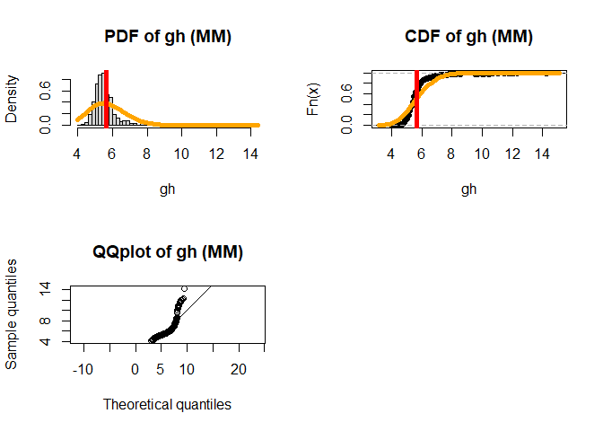
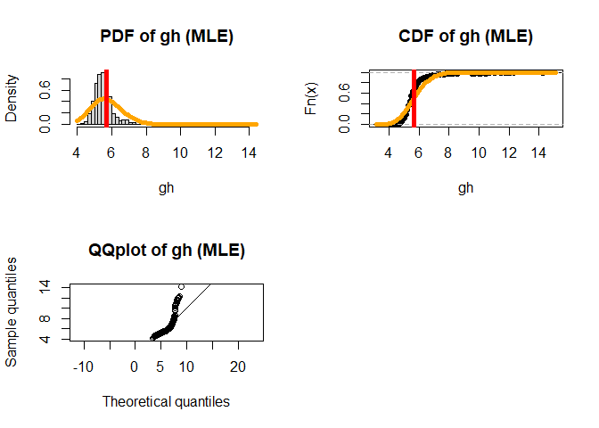
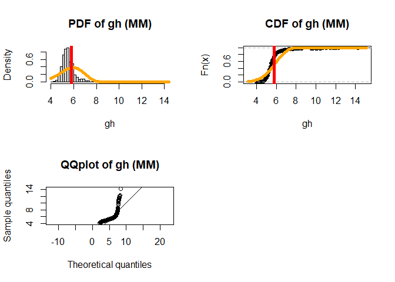
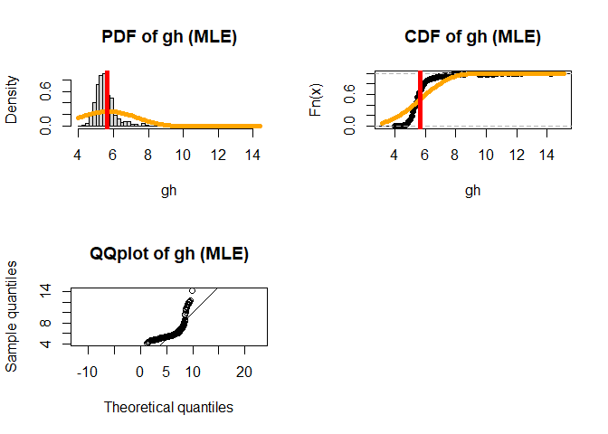
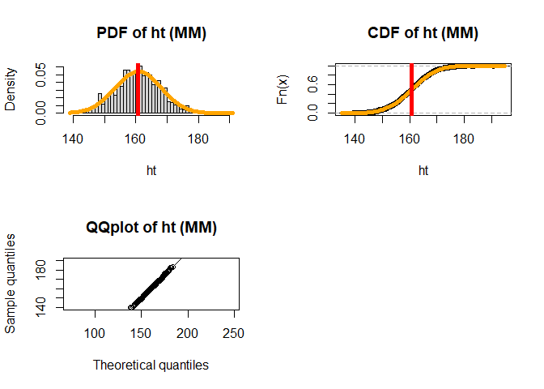
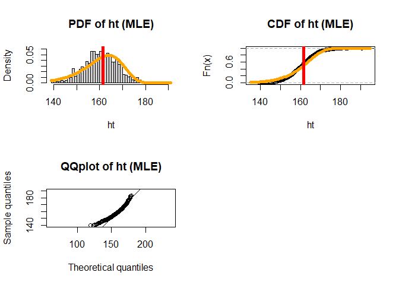

writeup
================
Jingyuan Wu
2021/11/6

## Modeling the unknown distribution with maximum likelihood and method of moments

This blog is going to explain how to use MLE and MM to model
`Glycohemoglobin` and `Height` of adult females, compare and contrast
these two methods on three different underlying distribution (normal,
gamma, weibull). The data is from National Health and Nutrition
Examination Survey 2009-2010 (NHANES), available from the built-in
package Hmisc.

``` r
library(tidyverse)
library(stats4)
require(dplyr)
Hmisc::getHdata(nhgh)
d1 <- nhgh %>% 
  filter(sex == "female") %>% 
  filter(age >= 18) %>% 
  select(gh, ht) %>% 
  filter(1:n()<=1000)
```

## Glycohemoglobin

\#Normal distribution

In MM method, the mean of the variable is the estimated expectation for
normal distribution. The variance/standard deviation of the variable is
the estimated variance/estimated standard deviation for normal
distribution. The median of the normal distribution with mean=estimated
expectation, sd=estimated standard deviation is estimated median.

``` r
#Normal
split.screen(c(2, 2))
```

    ## [1] 1 2 3 4

``` r
#MM PDF
xb_gh1 <- mean(d1$gh, na.rm=TRUE)
s2_gh1 <- var(d1$gh, na.rm=TRUE)


screen(1)
hist(d1$gh, freq = FALSE, breaks =50, main = "PDF of gh (MM)", xlab="gh")
curve(dnorm(x, xb_gh1, s2_gh1^.5), col="orange", lwd=5, add = TRUE)
abline(v=qnorm(.5, xb_gh1, s2_gh1^.5), col = "red", lwd = 5)


#MM CDF
screen(2)
plot(ecdf(d1$gh), main = "CDF of gh (MM)", xlab="gh")
curve(pnorm(x, xb_gh1, s2_gh1^.5), add = TRUE, lwd = 5, col = "orange")
abline(v=qnorm(.5, xb_gh1, s2_gh1^.5), col = "red", lwd = 5)


#QQ-plot
x <- qnorm((1:1000)/1000, xb_gh1, s2_gh1^.5)
y <- quantile(d1$gh, probs = (1:1000)/1000)
screen(3)
plot(x, y, asp = 1, xlab = "Theoretical quantiles", ylab = "Sample quantiles", main = "QQplot of gh (MM)")
abline(0,1)
```

<!-- -->

``` r
#dev.off()

print(paste0("e_mean=",xb_gh1))
```

    ## [1] "e_mean=5.7246"

``` r
print(paste0("e_sd=",s2_gh1^.5))
```

    ## [1] "e_sd=1.05224619840704"

``` r
print(paste0("e_median=",qnorm(.5, xb_gh1, s2_gh1^.5)))
```

    ## [1] "e_median=5.7246"

These three graphs show the distribution and estimated PDF, estimated
CDF and ECDF, QQ-plot of gh in MM method. The red line in first two
graphs stands for estimated median. The reference line in QQ-plot stands
for the line y=x.

In MLE method, first create a normal distribution, use `ll` to store the
sum of log likehood. Then use `mle` function to generate a series of
numbers based on the distribution. Optimizer starts with mean and sd
calculated from MM method to find the maximum. Calculate the coefficient
of these numbers to get the estimated mean and estimated variance for
MLE method. The median of the normal distribution with mean=estimated
expectation, sd=estimated standard deviation is estimated median.

``` r
#Normal
split.screen(c(2, 2))
```

    ## Warning in par(new = TRUE): 不绘图就不能调用par(new=TRUE)

    ## [1] 5 6 7 8

``` r
#MLE PDF
ll <- function(mean, sd)
    -sum(stats::dnorm(x=d1$gh, mean, sd, log=TRUE))
fit <- mle(minuslogl = ll , start = list(mean=xb_gh1, sd=s2_gh1^.5))

screen(1)
hist(d1$gh,freq = FALSE, breaks = 50, main = "PDF of gh (MLE)", xlab="gh")
curve(dnorm(x, mean = coef(fit)[1], sd = coef(fit)[2]), add = TRUE, col="orange", lwd=5)
abline(v=qnorm(.5, coef(fit)[1], coef(fit)[2]), col = "red", lwd = 5)


#CDF
screen(2)
plot(ecdf(d1$gh), main = "CDF of gh (MLE)", xlab="gh")
curve(pnorm(x, coef(fit)[1], coef(fit)[2]), add = TRUE, lwd = 5, col = "orange")
abline(v=qnorm(.5, coef(fit)[1], coef(fit)[2]), col = "red", lwd = 5)


#QQ-plot
x <- qnorm((1:1000)/1000, coef(fit)[1], coef(fit)[2])
y <- quantile(d1$gh, probs = (1:1000)/1000)
screen(3)
plot(x, y, asp = 1, xlab = "Theoretical quantiles", ylab = "Sample quantiles", main = "QQplot of gh (MLE)")
abline(0,1)
```

<!-- -->

``` r
#dev.off()

print(paste0("e_mean=",coef(fit)[1]))
```

    ## [1] "e_mean=5.7246"

``` r
print(paste0("e_sd=",coef(fit)[2]))
```

    ## [1] "e_sd=1.05172045901514"

``` r
print(paste0("e_median=",qnorm(.5, coef(fit)[1], coef(fit)[2])))
```

    ## [1] "e_median=5.7246"

These three graphs show the distribution and estimated PDF, estimated
CDF and ECDF, QQ-plot of gh in MLE method. The red line in first two
graphs stands for estimated median. The reference line in QQ-plot stands
for the line y=x.

Considering MM and MLE methods, as it bases on normal distribution,
where the theoretical mean and variance equal to the sample ones. Both
two methods shares estimated results. From the QQ-plots, the fitting
effect is not as good as considered.

## Gamma distribution

First, calculated the estimated parameters (estimated shape and
estimated rate) for gamma distribution based on the estimated
expectations and variance. Then do same in normal distribution, just
change `norm` to `gamma`.

``` r
#Gamma
split.screen(c(2, 2))
```

    ## Warning in par(new = TRUE): 不绘图就不能调用par(new=TRUE)

    ## [1]  9 10 11 12

``` r
#MM PDF
lh_gh1 <- xb_gh1/s2_gh1
ch_gh1 <- xb_gh1^2/s2_gh1

screen(1)
hist(d1$gh, freq = FALSE, breaks =50, main = "PDF of gh (MM)", xlab="gh")
curve(dgamma(x, ch_gh1, lh_gh1), col="orange", lwd=5, add = TRUE)
abline(v=qgamma(.5, ch_gh1, lh_gh1), col = "red", lwd = 5)


#MM CDF
screen(2)
plot(ecdf(d1$gh), main = "CDF of gh (MM)", xlab="gh")
curve(pgamma(x, ch_gh1, lh_gh1), add = TRUE, lwd = 5, col = "orange")
abline(v=qgamma(.5, ch_gh1, lh_gh1), col = "red", lwd = 5)


#QQ-plot
x <- qgamma((1:1000)/1000, ch_gh1, lh_gh1)
y <- quantile(d1$gh, probs = (1:1000)/1000)
screen(3)
plot(x, y, asp = 1, xlab = "Theoretical quantiles", ylab = "Sample quantiles", main = "QQplot of gh (MM)")
abline(0, 1)
```

<!-- -->

``` r
#dev.off()

print(paste0("e_shape=",ch_gh1))
```

    ## [1] "e_shape=29.5975362873171"

``` r
print(paste0("e_rate=",lh_gh1))
```

    ## [1] "e_rate=5.17023657326576"

``` r
print(paste0("e_median=",qgamma(.5, ch_gh1, lh_gh1)))
```

    ## [1] "e_median=5.66025909733103"

These three graphs show the distribution and estimated PDF, estimated
CDF and ECDF, QQ-plot of gh in MM method. The red line in first two
graphs stands for estimated median. The reference line in QQ-plot stands
for the line y=x.

In MLE method, change `norm` to `gamma` with estimated scale and
estimated rate.

``` r
#Gamma
split.screen(c(2, 2))
```

    ## Warning in par(new = TRUE): 不绘图就不能调用par(new=TRUE)

    ## [1] 13 14 15 16

``` r
#MLE PDF
ll <- function(scale, rate)
    -sum(stats::dgamma(x=d1$gh, scale, rate, log=TRUE))
fit <- mle(minuslogl = ll , start = list(scale=ch_gh1, rate=lh_gh1))

screen(1)
hist(d1$gh,freq = FALSE, breaks = 50, main = "PDF of gh (MLE)", xlab="gh")
curve(dgamma(x, coef(fit)[1], coef(fit)[2]), add = TRUE, col="orange", lwd=5)
abline(v=qgamma(.5, coef(fit)[1], coef(fit)[2]), col = "red", lwd = 5)


#CDF
screen(2)
plot(ecdf(d1$gh), main = "CDF of gh (MLE)", xlab="gh")
curve(pgamma(x, coef(fit)[1], coef(fit)[2]), add = TRUE, lwd = 5, col = "orange")
abline(v=qgamma(.5, coef(fit)[1], coef(fit)[2]), col = "red", lwd = 5)


#QQ-plot
x <- qgamma((1:1000)/1000, coef(fit)[1], coef(fit)[2])
y <- quantile(d1$gh, probs = (1:1000)/1000)
screen(3)
plot(x, y, asp = 1, xlab = "Theoretical quantiles", ylab = "Sample quantiles", main = "QQplot of gh (MLE)")
abline(0,1)
```

<!-- -->

``` r
#dev.off()

print(paste0("e_shape=",coef(fit)[1]))
```

    ## [1] "e_shape=40.811550528944"

``` r
print(paste0("e_rate=",coef(fit)[2]))
```

    ## [1] "e_rate=7.12916011834143"

``` r
print(paste0("e_median=",qgamma(.5, coef(fit)[1], coef(fit)[2])))
```

    ## [1] "e_median=5.67790663553131"

These three graphs show the distribution and estimated PDF, estimated
CDF and ECDF, QQ-plot of gh in MLE method. The red line in first two
graphs stands for estimated median. The reference line in QQ-plot stands
for the line y=x.

## Weibull distribution

First, calculated the estimated parameters (estimated shape and
estimated scale) for weibull distribution based on the estimated
expectations and variance. Then do same in gamma distribution, just
change `gamma` to `weibull`.

``` r
#lamda*gamma(1+1/k)=xb_gh1
#(gamma(1+1/k)^2)/(gamma(1+2/k) - gamma(1+1/k)^2)=(xb_gh1^2
#/s2_gh1)


tmp <- function(k){(gamma(1+1/k)^2)/(gamma(1+2/k) - gamma(1+1/k)^2)-(xb_gh1^2/s2_gh1)}
uniroot(tmp, c(1,10))
```

    ## $root
    ## [1] 6.353183
    ## 
    ## $f.root
    ## [1] 8.027666e-05
    ## 
    ## $iter
    ## [1] 6
    ## 
    ## $init.it
    ## [1] NA
    ## 
    ## $estim.prec
    ## [1] 6.103516e-05

``` r
k=uniroot(tmp, c(1,10))$root


tm <- function(lamda){lamda^2*(gamma(1+2/k) - gamma(1+1/k)^2)-s2_gh1}
uniroot(tm, c(2,100))
```

    ## $root
    ## [1] 6.151316
    ## 
    ## $f.root
    ## [1] -1.191499e-07
    ## 
    ## $iter
    ## [1] 13
    ## 
    ## $init.it
    ## [1] NA
    ## 
    ## $estim.prec
    ## [1] 6.103516e-05

``` r
lamda=uniroot(tm, c(1,10))$root


#Weibull
split.screen(c(2, 2))
```

    ## Warning in par(new = TRUE): 不绘图就不能调用par(new=TRUE)

    ## [1] 17 18 19 20

``` r
#MM PDF


screen(1)
hist(d1$gh, freq = FALSE, breaks =50, main = "PDF of gh (MM)", xlab="gh")
curve(dweibull(x, shape=k, scale=lamda), col="orange", lwd=5, add = TRUE)
abline(v=qweibull(.5, shape=k, scale=lamda), col = "red", lwd = 5)


#MM CDF
screen(2)
plot(ecdf(d1$gh), main = "CDF of gh (MM)", xlab="gh")
curve(pweibull(x, shape=k, scale=lamda), add = TRUE, lwd = 5, col = "orange")
abline(v=qweibull(.5, shape=k, scale=lamda), col = "red", lwd = 5)


#QQ-plot
x <- qweibull((1:1000)/1000, shape=k, scale=lamda)
y <- quantile(d1$gh, probs = (1:1000)/1000)
screen(3)
plot(x, y, asp = 1, xlab = "Theoretical quantiles", ylab = "Sample quantiles", main = "QQplot of gh (MM)")
abline(0, 1)
```

<!-- -->

``` r
#dev.off()

print(paste0("e_shape=",k))
```

    ## [1] "e_shape=6.35318320442431"

``` r
print(paste0("e_scale=",lamda))
```

    ## [1] "e_scale=6.15134021633724"

``` r
print(paste0("e_median=",qweibull(.5, shape=k, scale=lamda)))
```

    ## [1] "e_median=5.8065136390265"

These three graphs show the distribution and estimated PDF, estimated
CDF and ECDF, QQ-plot of gh in MLE method. The red line in first two
graphs stands for estimated median. The reference line in QQ-plot stands
for the line y=x.

``` r
#Weibull
split.screen(c(2, 2))
```

    ## Warning in par(new = TRUE): 不绘图就不能调用par(new=TRUE)

    ## [1] 21 22 23 24

``` r
#MLE PDF
ll <- function(shape, scale)
    -sum(stats::dweibull(x=d1$gh, shape, scale, log=TRUE))
fit <- mle(minuslogl = ll , start = list(shape=k, scale=lamda))
```

    ## Warning in stats::dweibull(x = d1$gh, shape, scale, log = TRUE): 产生了NaNs

    ## Warning in stats::dweibull(x = d1$gh, shape, scale, log = TRUE): 产生了NaNs

    ## Warning in stats::dweibull(x = d1$gh, shape, scale, log = TRUE): 产生了NaNs

    ## Warning in stats::dweibull(x = d1$gh, shape, scale, log = TRUE): 产生了NaNs

    ## Warning in stats::dweibull(x = d1$gh, shape, scale, log = TRUE): 产生了NaNs

    ## Warning in stats::dweibull(x = d1$gh, shape, scale, log = TRUE): 产生了NaNs

    ## Warning in stats::dweibull(x = d1$gh, shape, scale, log = TRUE): 产生了NaNs

    ## Warning in stats::dweibull(x = d1$gh, shape, scale, log = TRUE): 产生了NaNs

    ## Warning in stats::dweibull(x = d1$gh, shape, scale, log = TRUE): 产生了NaNs

    ## Warning in stats::dweibull(x = d1$gh, shape, scale, log = TRUE): 产生了NaNs

    ## Warning in stats::dweibull(x = d1$gh, shape, scale, log = TRUE): 产生了NaNs

``` r
screen(1)
hist(d1$gh,freq = FALSE, breaks = 50, main = "PDF of gh (MLE)", xlab="gh")
curve(dweibull(x, shape=coef(fit)[1], scale=coef(fit)[2]), add = TRUE, col="orange", lwd=5)
abline(v=qweibull(.5, shape=coef(fit)[1], scale=coef(fit)[2]), col = "red", lwd = 5)


#CDF
screen(2)
plot(ecdf(d1$gh), main = "CDF of gh (MLE)", xlab="gh")
curve(pweibull(x, shape=coef(fit)[1], scale=coef(fit)[2]), add = TRUE, lwd = 5, col = "orange")
abline(v=qweibull(.5, shape=coef(fit)[1], scale=coef(fit)[2]), col = "red", lwd = 5)


#QQ-plot
x <- qweibull((1:1000)/1000, shape=coef(fit)[1], scale=coef(fit)[2])
y <- quantile(d1$gh, probs = (1:1000)/1000)
screen(3)
plot(x, y, asp = 1, xlab = "Theoretical quantiles", ylab = "Sample quantiles", main = "QQplot of gh (MLE)")
abline(0,1)
```

<!-- -->

``` r
#dev.off()

print(paste0("e_shape=",coef(fit)[1]))
```

    ## [1] "e_shape=4.12524519118042"

``` r
print(paste0("e_scale=",coef(fit)[2]))
```

    ## [1] "e_scale=6.17388511265861"

``` r
print(paste0("e_median=",qweibull(.5, shape=coef(fit)[1], scale=coef(fit)[2])))
```

    ## [1] "e_median=5.64901945097356"

These three graphs show the distribution and estimated PDF, estimated
CDF and ECDF, QQ-plot of gh in MLE method. The red line in first two
graphs stands for estimated median. The reference line in QQ-plot stands
for the line y=x.

In conclusion, MM is simpler than MLE, not only in calculation, but also
in assumptions and limitations. In general, MLE has higher estimated
asymptotic efficiency. However, from combinations of graphs based on all
three distributions (normal, gamma and weibull), both MM and MLE methods
do not fit well for gt, though there’s not much dofference between
estimated median of MM and MLE.

## Height

## Normal distribution

Do same as above, just change gh to ht.

``` r
#Normal
split.screen(c(2, 2))
```

    ## Warning in par(new = TRUE): 不绘图就不能调用par(new=TRUE)

    ## [1] 25 26 27 28

``` r
#MM PDF
xb_ht1 <- mean(d1$ht, na.rm=TRUE)
s2_ht1 <- var(d1$ht, na.rm=TRUE)


screen(1)
hist(d1$ht, freq = FALSE, breaks =50, main = "PDF of ht (MM)", xlab="ht")
curve(dnorm(x, xb_ht1, s2_ht1^.5), col="orange", lwd=5, add = TRUE)
abline(v=qnorm(.5, xb_ht1, s2_ht1^.5), col = "red", lwd = 5)


#MM CDF
screen(2)
plot(ecdf(d1$ht), main = "CDF of ht (MM)", xlab="ht")
curve(pnorm(x, xb_ht1, s2_ht1^.5), add = TRUE, lwd = 5, col = "orange")
abline(v=qnorm(.5, xb_ht1, s2_ht1^.5), col = "red", lwd = 5)


#QQ-plot
x <- qnorm((1:1000)/1000, xb_ht1, s2_ht1^.5)
y <- quantile(d1$ht, probs = (1:1000)/1000)
screen(3)
plot(x, y, asp = 1, xlab = "Theoretical quantiles", ylab = "Sample quantiles", main = "QQplot of ht (MM)")
abline(0,1)
```

<!-- -->

``` r
#dev.off()

print(paste0("e_mean=",xb_ht1))
```

    ## [1] "e_mean=160.7419"

``` r
print(paste0("e_sd=",s2_ht1^.5))
```

    ## [1] "e_sd=7.32016114229387"

``` r
print(paste0("e_median=",qnorm(.5, xb_ht1, s2_ht1^.5)))
```

    ## [1] "e_median=160.7419"

``` r
#Normal
split.screen(c(2, 2))
```

    ## Warning in par(new = TRUE): 不绘图就不能调用par(new=TRUE)

    ## [1] 29 30 31 32

``` r
#MLE PDF
ll <- function(mean, sd)
    -sum(stats::dnorm(x=d1$ht, mean, sd, log=TRUE))
fit <- mle(minuslogl = ll , start = list(mean=xb_ht1, sd=s2_ht1^.5))

screen(1)
hist(d1$ht,freq = FALSE, breaks = 50, main = "PDF of ht (MLE)", xlab="ht")
curve(dnorm(x, mean = coef(fit)[1], sd = coef(fit)[2]), add = TRUE, col="orange", lwd=5)
abline(v=qnorm(.5, coef(fit)[1], coef(fit)[2]), col = "red", lwd = 5)


#CDF
screen(2)
plot(ecdf(d1$ht), main = "CDF of ht (MLE)", xlab="ht")
curve(pnorm(x, coef(fit)[1], coef(fit)[2]), add = TRUE, lwd = 5, col = "orange")
abline(v=qnorm(.5, coef(fit)[1], coef(fit)[2]), col = "red", lwd = 5)


#QQ-plot
x <- qnorm((1:1000)/1000, coef(fit)[1], coef(fit)[2])
y <- quantile(d1$ht, probs = (1:1000)/1000)
screen(3)
plot(x, y, asp = 1, xlab = "Theoretical quantiles", ylab = "Sample quantiles", main = "QQplot of ht (MLE)")
abline(0,1)
```

<!-- -->

``` r
#dev.off()

print(paste0("e_mean=",coef(fit)[1]))
```

    ## [1] "e_mean=160.7419"

``` r
print(paste0("e_sd=",coef(fit)[2]))
```

    ## [1] "e_sd=7.31650012666488"

``` r
print(paste0("e_median=",qnorm(.5, coef(fit)[1], coef(fit)[2])))
```

    ## [1] "e_median=160.7419"

## Gamma distribution

``` r
#Gamma
split.screen(c(2, 2))
```

    ## Warning in par(new = TRUE): 不绘图就不能调用par(new=TRUE)

    ## [1] 33 34 35 36

``` r
#MM PDF
lh_ht1 <- xb_ht1/s2_ht1
ch_ht1 <- xb_ht1^2/s2_ht1

screen(1)
hist(d1$ht, freq = FALSE, breaks =50, main = "PDF of ht (MM)", xlab="ht")
curve(dgamma(x, ch_ht1, lh_ht1), col="orange", lwd=5, add = TRUE)
abline(v=qgamma(.5, ch_ht1, lh_ht1), col = "red", lwd = 5)


#MM CDF
screen(2)
plot(ecdf(d1$ht), main = "CDF of ht (MM)", xlab="ht")
curve(pgamma(x, ch_ht1, lh_ht1), add = TRUE, lwd = 5, col = "orange")
abline(v=qgamma(.5, ch_ht1, lh_ht1), col = "red", lwd = 5)


#QQ-plot
x <- qgamma((1:1000)/1000, ch_ht1, lh_ht1)
y <- quantile(d1$ht, probs = (1:1000)/1000)
screen(3)
plot(x, y, asp = 1, xlab = "Theoretical quantiles", ylab = "Sample quantiles", main = "QQplot of ht (MM)")
abline(0, 1)
```

<!-- -->

``` r
#dev.off()

print(paste0("e_shape=",ch_ht1))
```

    ## [1] "e_shape=482.188570516702"

``` r
print(paste0("e_rate=",lh_ht1))
```

    ## [1] "e_rate=2.99976901179283"

``` r
print(paste0("e_median=",qgamma(.5, ch_ht1, lh_ht1)))
```

    ## [1] "e_median=160.630793999664"

``` r
#Gamma
split.screen(c(2, 2))
```

    ## Warning in par(new = TRUE): 不绘图就不能调用par(new=TRUE)

    ## [1] 37 38 39 40

``` r
#MLE PDF
ll <- function(scale, rate)
    -sum(stats::dgamma(x=d1$ht, scale, rate, log=TRUE))
fit <- mle(minuslogl = ll , start = list(scale=ch_ht1, rate=lh_ht1))

screen(1)
hist(d1$ht,freq = FALSE, breaks = 50, main = "PDF of ht (MLE)", xlab="ht")
curve(dgamma(x, coef(fit)[1], coef(fit)[2]), add = TRUE, col="orange", lwd=5)
abline(v=qgamma(.5, coef(fit)[1], coef(fit)[2]), col = "red", lwd = 5)


#CDF
screen(2)
plot(ecdf(d1$ht), main = "CDF of ht (MLE)", xlab="ht")
curve(pgamma(x, coef(fit)[1], coef(fit)[2]), add = TRUE, lwd = 5, col = "orange")
abline(v=qgamma(.5, coef(fit)[1], coef(fit)[2]), col = "red", lwd = 5)


#QQ-plot
x <- qgamma((1:1000)/1000, coef(fit)[1], coef(fit)[2])
y <- quantile(d1$ht, probs = (1:1000)/1000)
screen(3)
plot(x, y, asp = 1, xlab = "Theoretical quantiles", ylab = "Sample quantiles", main = "QQplot of ht (MLE)")
abline(0,1)
```

<!-- -->

``` r
#dev.off()

print(paste0("e_shape=",coef(fit)[1]))
```

    ## [1] "e_shape=482.188570516739"

``` r
print(paste0("e_rate=",coef(fit)[2]))
```

    ## [1] "e_rate=2.99976901240255"

``` r
print(paste0("e_median=",qgamma(.5, coef(fit)[1], coef(fit)[2])))
```

    ## [1] "e_median=160.630793967027"

## Weibull distribution

``` r
#lamda*gamma(1+1/k)=xb_ht1
#(gamma(1+1/k)^2)/(gamma(1+2/k) - gamma(1+1/k)^2)=(xb_ht1^2
#/s2_ht1)


tmp <- function(k){(gamma(1+1/k)^2)/(gamma(1+2/k) - gamma(1+1/k)^2)-(xb_ht1^2/s2_ht1)}
uniroot(tmp, c(3,100))
```

    ## $root
    ## [1] 27.4594
    ## 
    ## $f.root
    ## [1] -3.947385e-05
    ## 
    ## $iter
    ## [1] 9
    ## 
    ## $init.it
    ## [1] NA
    ## 
    ## $estim.prec
    ## [1] 6.103516e-05

``` r
k=uniroot(tmp, c(3,100))$root


tm <- function(lamda){lamda^2*(gamma(1+2/k) - gamma(1+1/k)^2)-s2_ht1}
uniroot(tm, c(2,200))
```

    ## $root
    ## [1] 163.9807
    ## 
    ## $f.root
    ## [1] -6.752572e-08
    ## 
    ## $iter
    ## [1] 6
    ## 
    ## $init.it
    ## [1] NA
    ## 
    ## $estim.prec
    ## [1] 6.103516e-05

``` r
lamda=uniroot(tm, c(2,200))$root


#Weibull
split.screen(c(2, 2))
```

    ## Warning in par(new = TRUE): 不绘图就不能调用par(new=TRUE)

    ## [1] 41 42 43 44

``` r
#MM PDF


screen(1)
hist(d1$ht, freq = FALSE, breaks =50, main = "PDF of ht (MM)", xlab="ht")
curve(dweibull(x, shape=k, scale=lamda), col="orange", lwd=5, add = TRUE)
abline(v=qweibull(.5, shape=k, scale=lamda), col = "red", lwd = 5)


#MM CDF
screen(2)
plot(ecdf(d1$ht), main = "CDF of ht (MM)", xlab="ht")
curve(pweibull(x, shape=k, scale=lamda), add = TRUE, lwd = 5, col = "orange")
abline(v=qweibull(.5, shape=k, scale=lamda), col = "red", lwd = 5)


#QQ-plot
x <- qweibull((1:1000)/1000, shape=k, scale=lamda)
y <- quantile(d1$ht, probs = (1:1000)/1000)
screen(3)
plot(x, y, asp = 1, xlab = "Theoretical quantiles", ylab = "Sample quantiles", main = "QQplot of ht (MM)")
abline(0, 1)
```

<!-- -->

``` r
#dev.off()

print(paste0("e_shape=",k))
```

    ## [1] "e_shape=27.4594017393995"

``` r
print(paste0("e_scale=",lamda))
```

    ## [1] "e_scale=163.980699694019"

``` r
print(paste0("e_median=",qweibull(.5, shape=k, scale=lamda)))
```

    ## [1] "e_median=161.806518094376"

``` r
#Weibull
split.screen(c(2, 2))
```

    ## Warning in par(new = TRUE): 不绘图就不能调用par(new=TRUE)

    ## [1] 45 46 47 48

``` r
#MLE PDF
ll <- function(shape, scale)
    -sum(stats::dweibull(x=d1$ht, shape, scale, log=TRUE))
fit <- mle(minuslogl = ll , start = list(shape=k, scale=lamda))
```

    ## Warning in stats::dweibull(x = d1$ht, shape, scale, log = TRUE): 产生了NaNs

``` r
screen(1)
hist(d1$ht,freq = FALSE, breaks = 50, main = "PDF of ht (MLE)", xlab="ht")
curve(dweibull(x, shape=coef(fit)[1], scale=coef(fit)[2]), add = TRUE, col="orange", lwd=5)
abline(v=qweibull(.5, shape=coef(fit)[1], scale=coef(fit)[2]), col = "red", lwd = 5)


#CDF
screen(2)
plot(ecdf(d1$ht), main = "CDF of ht (MLE)", xlab="ht")
curve(pweibull(x, shape=coef(fit)[1], scale=coef(fit)[2]), add = TRUE, lwd = 5, col = "orange")
abline(v=qweibull(.5, shape=coef(fit)[1], scale=coef(fit)[2]), col = "red", lwd = 5)


#QQ-plot
x <- qweibull((1:1000)/1000, shape=coef(fit)[1], scale=coef(fit)[2])
y <- quantile(d1$ht, probs = (1:1000)/1000)
screen(3)
plot(x, y, asp = 1, xlab = "Theoretical quantiles", ylab = "Sample quantiles", main = "QQplot of ht (MLE)")
abline(0,1)
```

<!-- -->

``` r
#dev.off()

print(paste0("e_shape=",coef(fit)[1]))
```

    ## [1] "e_shape=21.8542589821422"

``` r
print(paste0("e_scale=",coef(fit)[2]))
```

    ## [1] "e_scale=164.24745408768"

``` r
print(paste0("e_median=",qweibull(.5, shape=coef(fit)[1], scale=coef(fit)[2])))
```

    ## [1] "e_median=161.515865988725"

In conclusion, both MM and MLE methods based on these three
distributions (normal, gamma and weibull) fit well for ht, especially on
normal.

## Take-home messages

In conclusion, both MM and MLE methods of three distributions (normal,
gamma and weibull) fit well for ht but not for gh.

For ht, it fits better on normal and gamma distribution, and then
weibull distribution.

MM and MLE are probably more suitable for the variables normally
distributed or gathering around median, which needs further exploration.
